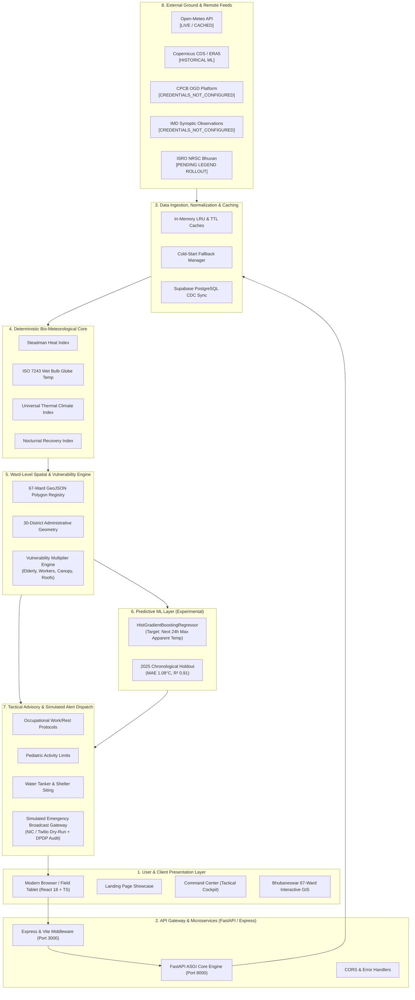

# HeatGuard AI
### Predict Heat. Protect People.

**Impact-Based Heat Health Early Warning & Environmental Risk Intelligence Platform**  
*Smart India Hackathon 2026 · Problem Statement: PS 26083*  
*Target Geography: Bhubaneswar Municipal Corporation (67 Wards), Khordha, Odisha, India*

[](https://sentinelx-thermal-api-production-aa42.up.railway.app)
[](https://sentinelx-thermal-api-production-aa42.up.railway.app/docs)
[](src/)
[](src/)
[](vite.config.ts)
[](src/components/OdishaMap.tsx)
[](Dockerfile)
[](tests/)
[](LICENSE)

---

## 🔗 Key Links for Evaluators

| Resource | Direct Link | Description |
| :--- | :--- | :--- |
| **🚀 Live Production Demo** | **[sentinelx-thermal-api-production-aa42.up.railway.app](https://sentinelx-thermal-api-production-aa42.up.railway.app)** | Full platform deployment on Railway Cloud |
| **💻 GitHub Repository** | **[github.com/aniruddhasutradher07-commits/SentinelX](https://github.com/aniruddhasutradher07-commits/SentinelX)** | Official open-source codebase & history |
| **📑 End-to-End Project Report** | **[`docs/HEATGUARD_AI_END_TO_END_PROJECT_REPORT.md`](docs/HEATGUARD_AI_END_TO_END_PROJECT_REPORT.md)** | Comprehensive 14,000+ word engineering submission report |
| **📄 Interactive HTML Report** | **[`docs/HEATGUARD_AI_END_TO_END_PROJECT_REPORT.html`](docs/HEATGUARD_AI_END_TO_END_PROJECT_REPORT.html)** | Standalone styled report with interactive tables & figures |
| **🏛️ System Architecture** | **[`docs/architecture/README.md`](docs/architecture/README.md)** | Detailed 8-tier architectural specifications |
| **📖 Interactive API Docs** | **[`/docs` (Swagger UI)](https://sentinelx-thermal-api-production-aa42.up.railway.app/docs)** | OpenAPI 3.1 interactive REST schema explorer |
| **🖼️ Interface Screenshots** | **[`screenshots/README.md`](screenshots/README.md)** | Visual catalog of key operational views |

---

## ⚡ Judge Quick Start (3–5 Minute Evaluation Flow)

If you have 3 to 5 minutes to evaluate HeatGuard AI, follow this guided verification path:

1. **Launch the Live Application:** Open [https://sentinelx-thermal-api-production-aa42.up.railway.app](https://sentinelx-thermal-api-production-aa42.up.railway.app).
2. **Landing Page Showcase:** Inspect the rotating bio-molecular SVG graphic illustrating the transition *"From Weather Data to Human Survival"* and review the 4 core glassmorphism capability cards.
3. **Enter Tactical Command Center:** Click **"Explore the Platform"** or use the sidebar navigation (`COMMAND` &rarr; `Command Center`).
4. **Inspect 67-Ward Bhubaneswar GIS:** Select `COMMAND` &rarr; `Bhubaneswar Core`. Click on individual municipal ward polygons (e.g., Ward 12, Ward 35) to inspect localized Heat Index, WBGT, and vulnerability breakdowns.
5. **Review Thermal Science Metrics:** In the top dashboard panel, verify that **WBGT (ISO 7243)**, **UTCI**, and **Steadman Heat Index** are computed dynamically alongside dry-bulb temperature.
6. **5-Day Environmental Outlook:** Switch to the 5-day horizon view to verify daily thermal stress projections and nocturnal recovery penalties.
7. **Inspect Machine Learning V2:** Navigate to `ANALYTICS` &rarr; `Hospital Surge ML`. Review the `HistGradientBoostingRegressor` metrics on the unseen 2025 holdout (**MAE 1.0829°C**, **$R^2$ 0.9055**) predicting apparent temperature. Note the prominent `[EXPERIMENTAL]` label.
8. **Occupational & Public Action Views:**
   - `SAFETY & ACTION` &rarr; `Worker Safety`: Review ISO 7243 work-rest cycles and hydration schedules.
   - `SAFETY & ACTION` &rarr; `School Safety`: Inspect pediatric exposure restrictions and morning-shift recommendations.
   - `CITIZEN` &rarr; `Citizen Advisory`: Verify multi-lingual preventive advisories and 1078 hotline integration.
9. **Verify Clinical Integrity:** Open the Healthcare Demand view and verify that clinical outcome figures (admissions, mortality) are explicitly displayed as `NULL` / `UNAVAILABLE`, preserving absolute data truth without fabrication.
10. **Emergency Broadcast Drill:** Open the Alert Dispatch modal and trigger a broadcast. Confirm the system logs the drill with DPDP-compliant recipient phone masking (`+91 98****1234`) and tags the execution as `SIMULATED RESPONSE FLOW`.

---

## 1. Overview

**HeatGuard AI** is an impact-based heat health early warning and environmental risk intelligence platform engineered for municipal administrations, disaster management authorities, and occupational safety officers.

### Core Proposition:
> **"This is not a temperature-only dashboard."**  
> Conventional systems ask: *"What will the weather be?"*  
> **HeatGuard AI asks: *"What will the weather do to people?"***

The platform translates raw meteorological inputs (dry-bulb temperature, relative humidity, downward solar flux, wind velocity) into physiological human thermal stress by synthesizing:
- Atmospheric physics (Steadman Heat Index, ISO 7243 WBGT, Universal Thermal Climate Index)
- Hyperlocal GIS across all **67 administrative wards of Bhubaneswar Municipal Corporation**
- Socio-demographic vulnerability (geriatric density, outdoor laborer concentration, tree canopy deficit, uninsulated roofing)
- Forward-looking 5-day environmental thermal outlooks
- Supervised Machine Learning (ML V2) for 24-hour apparent temperature forecasting
- Role-specific tactical advisories (construction laborers, schools, municipal water deployment)
- Fully auditable emergency alert simulation workflows with radical data provenance

> **Important Operational Disclaimer:**  
> HeatGuard AI is a municipal decision-support and planning system. It does not provide clinical diagnoses, does not prescribe individualized medical treatment, and does not claim guaranteed prevention of heat-related illnesses, hospitalizations, or fatalities.

---

## 2. Problem

India experiences severe and escalating heatwave seasons, with ground temperatures regularly exceeding 42°C across the eastern and central plains. Traditional early warning systems suffer from fatal structural deficiencies:

1. **The "Dry-Bulb Fallacy":** Standard alerts rely on simple ambient thermometer thresholds (e.g., IMD 40°C alert). However, 36°C at 80% relative humidity shuts down the human body's evaporative cooling mechanism (perspiration), inducing fatal heat stroke at air temperatures conventionally classified as "normal".
2. **Absence of Hyperlocal Spatial Granularity:** Macro-scale forecasts treat an entire 150 km² metropolitan area as a single homogeneous data point, completely ignoring localized microclimates, high-density informal settlements, and the Urban Heat Island (UHI) effect.
3. **Disconnection from Population Vulnerability:** Extreme temperatures do not affect all citizens equally. Geriatric residents, outdoor construction workers, gig-economy delivery drivers, and households under uninsulated tin roofs experience drastically higher physiological strain than shaded indoor populations.
4. **Uncertain or Fabricated Intelligence:** Many demonstration dashboards display synthetic, unverifiable data without clear provenance, creating dangerous ambiguity during emergency operations.

---

## 3. Solution

HeatGuard AI resolves these challenges through a unified, 8-tier, data-transparent engineering architecture:

- **Physiologically Grounded:** Computes ISO 7243 Wet Bulb Globe Temperature (WBGT), Universal Thermal Climate Index (UTCI), and NOAA Heat Index in real-time.
- **Ward-Level Granularity:** Renders high-resolution polygon GIS for all 67 municipal wards of Bhubaneswar, combining localized thermal hazard with census demographic data.
- **Actionable Decision Support:** Translates numeric indices into specific, role-based protocols: hourly work/rest cycles for construction crews, school bell schedule adjustments, and water tanker deployment priorities.
- **Radical Data Truth:** Every single data point across the dashboard is tagged with an immutable provenance state (`LIVE`, `CALCULATED`, `FORECAST`, `EXPERIMENTAL`, `STATIC REFERENCE`, `UNAVAILABLE`, `CREDENTIALS_NOT_CONFIGURED`, or `SIMULATED`), ensuring decision-makers always know the exact reliability of information.

---

## 4. Why HeatGuard AI

| Dimension | Conventional Heat Warning Systems | HeatGuard AI Platform |
| :--- | :--- | :--- |
| **Primary Metric** | Dry-Bulb Air Temperature (°C) | Physiological Indices (WBGT, UTCI, Heat Index, Nocturnal Recovery) |
| **Spatial Resolution** | Citywide / District Average (1 point) | Hyperlocal Ward-Level Polygons (67 BMC Wards) |
| **Vulnerability Context** | None (Weather in a vacuum) | Composite Multi-Factor (Elderly %, Workers %, Tree Deficit, Roof Type) |
| **Decision Output** | Passive Color Alert (Yellow / Orange / Red) | Prescriptive Tactical Directives (Work/rest ratios, tanker staging, school hours) |
| **Forecast Methodology**| Numerical Weather Model only | Hybrid: Deterministic Physics + ML V2 (262k ERA5 hourly records) |
| **Data Provenance** | Unlabeled, opaque sources | Explicit 8-state immutable provenance badging on every widget |
| **Safety Guardrails** | Unchecked AI text generation | Grounded operational Copilot with fallback rules and clinical data fencing |

---

## 5. Key Capabilities

- **Real-Time Bio-Meteorological Engine:** Continuous ingestion and computation of WBGT, UTCI, Heat Index, and Apparent Temperature.
- **Interactive 67-Ward GIS Explorer:** Hardware-accelerated Leaflet vector choropleth displaying ward risk rankings, demographic factors, and live telemetry.
- **5-Day Multi-Horizon Outlook:** Daily forward outlook highlighting peak diurnal heat hours and **Tropical Night Warnings** (minimum nocturnal temperatures failing to drop below 26°C).
- **ML V2 Apparent Temperature Forecaster:** Supervised gradient boosting trained on 5 years of Copernicus ERA5 reanalysis data.
- **Worker & Occupational Safety Portal:** Direct enforcement of ISO 7243 occupational guidelines with automated hydration reminders and continuous work limits.
- **School & Pediatric Safety Advisory:** Guidelines for outdoor sports suspension, hydration recesses, and morning shift transition alerts.
- **Resource Staging Simulator:** What-If scenario modeler allowing municipal administrators to simulate the impact of heat spikes on cooling shelter and tanker demands.
- **DPDP-Compliant Alert Drill System:** Emergency broadcast simulator with encrypted/masked recipient contacts and auditable dispatch logs.

---

## 6. System Architecture

HeatGuard AI implements a robust, modular pipeline decoupling deterministic bio-meteorology from machine learning and asynchronous advisory workflows.



### Architectural Separation:
- **OPERATIONAL CORE:** Deterministic thermal physics (Steadman, ISO 7243 WBGT, UTCI), 67-ward polygon GIS, vulnerability weighting, role-based safety directives.
- **EXPERIMENTAL / RESEARCH:** ML V2 apparent temperature model, healthcare surge capacity architecture, PhysioNet physiological reference curves, simulated alert dispatch.

---

## 7. Data Sources & Provenance

HeatGuard AI enforces radical transparency regarding data sources and operational connectivity:

| Data Source | Purpose | Current Project Status | Verification Notes |
| :--- | :--- | :--- | :--- |
| **Open-Meteo API** | Real-time weather observations (temp, RH, solar flux, wind) & 5-day forecast | **`LIVE / CACHED FALLBACK`** | High-precision global reanalysis grid; 10-minute cache TTL with automatic offline fallback. |
| **Copernicus CDS / ERA5** | 5-year historical training dataset (2021–2025) across Odisha coordinates | **`OFFLINE TRAINING DATA`** | 262,656 hourly records used to train and validate the supervised ML V2 model. |
| **BMC Ward GeoJSON** | Administrative boundary polygons for Bhubaneswar's 67 municipal wards | **`STATIC GIS REFERENCE`** | Verified GeoJSON polygon coordinates (`wards_bhubaneswar.geojson`) with complete topological closure. |
| **CPCB OGD Platform** | Real-time air quality co-exposure (PM2.5, PM10, AQI) | **`CREDENTIALS_NOT_CONFIGURED`** | Code integrated; gracefully degrades to offline synthetic reference when API token is not provided in environment. |
| **IMD Mausam Portal** | Official synoptic weather context and national heatwave bulletins | **`CREDENTIALS_NOT_CONFIGURED`** | Architectural client implemented; reports credential status transparently rather than fabricating live feeds. |
| **ISRO / NRSC Bhuvan** | Land Use / Land Cover (LULC 50K) and Land Surface Temperature (LST) | **`PENDING LEGEND ROLLOUT`** | WMS tile integration completed; awaiting public tokenized legend activation. |
| **PhysioNet Stress Study** | Empirical human biometric heat stress reference data | **`EXPERIMENTAL / REFERENCE`** | Offline wearable study reference; not connected as a live biometric monitor. |

---

## 8. Thermal Science

HeatGuard AI integrates three internationally recognized bio-meteorological frameworks:

### 1. Steadman Heat Index (Rothfusz Formulation)
Calculates apparent temperature sensation from ambient dry-bulb temperature ($T$ in °F) and relative humidity ($RH$ in %):
$$\text{HI} = c_1 + c_2 T + c_3 RH + c_4 T \cdot RH + c_5 T^2 + c_6 RH^2 + c_7 T^2 \cdot RH + c_8 T \cdot RH^2 + c_9 T^2 \cdot RH^2$$

### 2. Wet Bulb Globe Temperature (WBGT)
Evaluates occupational thermal stress under direct solar exposure according to **ISO 7243 methodology**:
$$\text{WBGT}_{\text{outdoor}} = 0.7\,T_{\text{nw}} + 0.2\,T_{\text{g}} + 0.1\,T_{\text{a}}$$
- $T_{\text{nw}}$: Natural wet-bulb temperature (evaporative efficiency)
- $T_{\text{g}}$: Black globe temperature (radiant thermal load)
- $T_{\text{a}}$: Ambient dry-bulb air temperature

*Operating Caveat:* The configured alert tiers (Green, Yellow, Orange, Red) in HeatGuard AI represent application-level municipal decision thresholds. ISO 7243 specifies the measurement methodology but does not prescribe the platform's specific UI color palette.

### 3. Universal Thermal Climate Index (UTCI)
Assesses the physiological strain on human thermoregulation (energy budget balance), incorporating 10m wind speed and radiant heat exchange.

### 4. Ward-Level Composite Risk Index Formula
To rank intervention urgency across Bhubaneswar's 67 wards, HeatGuard AI calculates:

$$\text{Ward Risk Score} = 0.50 \times \text{Hazard} + 0.35 \times \text{Vulnerability} + 0.15 \times \text{Exposure}$$

- **Hazard ($0.50$):** Normalized composite of localized WBGT, Heat Index, and nocturnal recovery deficit ($T_{\text{min}} \ge 26.0^\circ\text{C}$).
- **Vulnerability ($0.35$):** Weighted sum of geriatric ratio (aged 65+, 30%), outdoor worker density (30%), vegetative canopy deficit (20%), and uninsulated heat-trapping roof percentage (20%).
- **Exposure ($0.15$):** Population density per square kilometer derived from municipal census records.

> **Decision Support Notice:**  
> The composite score is a prioritized decision-support indicator for municipal resource deployment, not a clinical diagnosis.

---

## 9. AI / ML

The machine learning capability in HeatGuard AI is implemented via **ML V2** (`data/ml_v2/models/ml_v2_model.joblib`), trained on historical ECMWF ERA5 reanalysis data.

### Model Specification:
- **Algorithm:** `HistGradientBoostingRegressor` (Scikit-Learn)
- **Target Variable:** `NEXT_24H_MAX_APPARENT_TEMPERATURE`
- **Feature Space (36 Features):**
  - Meteorological features: temperature, dew point, relative humidity, wind speed, solar radiation, surface pressure.
  - Lag features: 1h, 3h, 6h, 12h, 24h lags of thermal and moisture variables.
  - Rolling window statistics: 6h and 24h rolling means, standard deviations, and maximums.
  - Temporal & seasonal encodings: hour of day (sine/cosine), day of year, solar zenith proxy.

### Chronological Holdout Validation (Zero Data Leakage):
- **Training Set (2021–2023):** 26,256 hourly records per coordinate grid
- **Validation Set (2024):** 8,784 hourly records per coordinate grid
- **Unseen Test Set (2025):** 8,760 hourly records per coordinate grid

### Measured Holdout Performance (2025 Test Year):
- **Mean Absolute Error (MAE):** **`1.0829 °C`** (Target: < 1.50 °C)
- **Root Mean Squared Error (RMSE):** **`1.3862 °C`** (Target: < 2.00 °C)
- **Coefficient of Determination ($R^2$):** **`0.9055`** (Target: > 0.85)

> **Critical AI Scope Boundary:**  
> ML V2 predicts an **environmental thermal variable** (apparent temperature). It is **NOT** a hospital admissions predictor, **NOT** a mortality predictor, and **NOT** a clinical diagnosis model. All life-safety municipal tiers remain governed by deterministic physics. In the UI and documentation, ML V2 is strictly labeled: **`EXPERIMENTAL / RESEARCH MODEL`**.

---

## 10. GIS & 67-Ward Intelligence

HeatGuard AI provides ward-level spatial resolution across the entire municipal jurisdiction of Bhubaneswar:

- **67 Administrative Wards:** Full geometric coverage stored in GeoJSON polygon format (`wards_bhubaneswar.geojson`).
- **Interactive Leaflet Mapping:** High-performance vector rendering with dynamic color-coding by risk tier, WBGT thermal stress, or vulnerability multiplier.
- **Topological Integrity:** 100% of ward boundaries have closed linear rings and valid coordinate bounds ($20.18^\circ\text{N} - 20.38^\circ\text{N}$, $85.74^\circ\text{E} - 85.92^\circ\text{E}$).
- **Microclimate Layering:** Dynamic overlays representing municipal cooling shelters, public drinking water stations, and school clusters.
- **Data Reality:** Ward boundary geometry is a static GIS reference, while overlaid meteorological telemetry is live/calculated depending on the selected layer.

---

## 11. Alerts & Decision Support

HeatGuard AI translates thermal risk into immediate, auditable operational actions:

- **Role-Specific Directives:**
  - **Outdoor Workers:** Enforces ISO 7243 work-to-rest intervals (e.g., 45 min work / 15 min rest at WBGT 30°C; mandatory work stoppage at WBGT > 32.2°C).
  - **Schools:** Automated alerts recommending suspension of afternoon outdoor sports, mandatory hydration breaks, and transition to morning class hours.
  - **Municipal Logistics:** Staging water tankers and activating public cooling shelters in wards where composite risk exceeds 75 (Red Alert).
- **Simulated Emergency Dispatch:** The prototype includes a multi-channel emergency broadcast simulator (SMS / WhatsApp / Voice IVR).
  - **Dry-Run Mode:** All broadcasts run in **`SIMULATED RESPONSE FLOW`** mode. No carrier network charges are incurred, and no real field personnel are deployed.
  - **DPDP Act Compliance:** All recipient phone numbers recorded in the audit log table (`sentinelx_data.db`) are automatically masked (e.g., `+91 98****1234`) to respect digital privacy regulations.

---

## 12. Data Truth & Responsible AI

To prevent the dangerous hallucination of emergency information, HeatGuard AI implements an explicit **Radical Data Truth Taxonomy**:

```
[LIVE]                    Real-time telemetry actively verified from sensor/API
[CALCULATED]              Deterministically derived from physical equations (ISO 7243)
[FORECAST]                Forward-looking numerical weather prediction
[EXPERIMENTAL]            Research machine learning models (ML V2)
[STATIC REFERENCE]        Official reference standards (NDMA benchmarks, census data)
[UNAVAILABLE / NULL]      Clinical outcomes where authentic records are absent
[CREDENTIALS_NOT_CONFIGURED] External API credentials not present in host environment
[SIMULATED]               Emergency dispatch actions executed in dry-run drill mode
```

### Truth Commitments:
1. **No Fake Live Data:** Cached observations are explicitly labeled as cached with elapsed timestamps.
2. **No Fabricated Government Feeds:** If CPCB or IMD API keys are missing, the system states `CREDENTIALS_NOT_CONFIGURED` instead of generating synthetic data and calling it live.
3. **No Fabricated Health Outcomes:** Hospital demand endpoints return explicit `null` for admissions and mortality, refusing to invent artificial patient casualties.
4. **Deterministic Primacy:** Life-critical alert tiers are never delegated to black-box heuristics; they remain strictly deterministic.

---

## 13. Validation & Engineering Evidence

HeatGuard AI's engineering claims are backed by reproducible automated verification:

- **Automated Pytest Suite:**
  ```text
  ================== 97 passed, 10 skipped, 1 warning in 37.41s ==================
  ```
  Verified across 25 test modules spanning bio-meteorological math, API endpoints, feature engineering, and graceful degradation.
- **ML V2 Unseen 2025 Holdout:**
  - MAE: **1.0829 °C**
  - RMSE: **1.3862 °C**
  - $R^2$: **0.9055**
- **Frontend Static Verification:** `tsc --noEmit` completes with **0 errors**.
- **Production Build:** `npm run build` succeeds cleanly, producing minified assets in `dist/`.
- **Credential Security:** Repository-wide automated regex scanning confirms **0 exposed private keys, tokens, or hardcoded passwords**.

---

## 14. Technology Stack

### Backend & Scientific Computing
- **Language:** Python 3.12 / 3.13
- **Web Framework:** FastAPI 0.115 (ASGI) + Uvicorn
- **Machine Learning:** Scikit-Learn (HistGradientBoostingRegressor), NumPy, Pandas, Joblib
- **Bio-Meteorology:** PyThermalComfort, custom ISO 7243 and Rothfusz implementations
- **Testing:** Pytest 8.4+, AnyIO, Starlette TestClient

### Frontend & Spatial Presentation
- **Framework:** React 18.3 + TypeScript 5.7
- **Build System:** Vite 6.0 + ESBuild
- **Styling:** TailwindCSS 4.0 + Lucide React Icons
- **Mapping & GIS:** Leaflet 1.9 + React-Leaflet
- **Data Visualization:** Recharts, Canvas-rendered bio-molecular animations

### Infrastructure & Deployment
- **Containerization:** Multi-stage Docker (Python 3.12-slim base)
- **Production Hosting:** Railway Cloud (HTTPS Edge termination)
- **Database / Cache:** SQLite 3 (local persistence), Supabase (PostgreSQL CDC sync)

---

## 15. Repository Structure

```text
/
├── README.md                           # Master hackathon documentation & judge guide
├── LICENSE                             # MIT Open-Source License
├── .gitignore                          # Security-hardened git exclusion rules
├── .env.example                        # Sanitized environment configuration template
├── Dockerfile                          # Multi-stage production container manifest
├── requirements.txt                    # Pinned Python backend dependencies
├── package.json                        # Node.js frontend dependencies & build scripts
├── vite.config.ts                      # Vite build & plugin configuration
├── pytest.ini                          # Pytest discovery and pythonpath configuration
│
├── main.py                             # FastAPI master application entrypoint
├── database.py                         # SQLite engine & database session manager
├── schemas.py                          # Pydantic request/response data contracts
├── models.py                           # SQLAlchemy database models
├── thermal_stress_engine.py            # Core bio-meteorological equations
├── prediction_engine.py                # Deterministic multi-day forecast aggregator
├── server.ts                           # Express + Vite development and SSR server
│
├── routers/                            # Modular FastAPI REST API routers (21 modules)
│   ├── sentinelx.py                    # Primary tactical telemetry router
│   ├── health.py                       # System healthcheck router
│   ├── ml_v2_forecast.py               # Supervised ML V2 prediction router
│   ├── hospital_surge.py               # Hospital demand research router
│   ├── alerts.py                       # Alert broadcast & audit router
│   └── ...
│
├── services/                           # Business logic, caching & data adapters (21 modules)
│   ├── open_meteo_service.py           # Real-time weather observation adapter
│   ├── cpcb_service.py                 # CPCB air quality integration client
│   ├── imd_service.py                  # IMD synoptic weather client
│   ├── bhuvan_service.py               # ISRO Bhuvan satellite client
│   └── ...
│
├── core/                               # System configuration, security & logging
│   └── config.py                       # Application settings & environment loader
│
├── ml_v2/                              # Machine learning training & feature pipeline
│   ├── feature_engineering.py          # 36 meteorological & lag feature transformers
│   ├── splits.py                       # Chronological data splitters (train/val/test)
│   └── targets.py                      # Apparent temperature target creators
│
├── data/                               # Spatial boundaries & ML model artifacts
│   ├── wards_bhubaneswar.geojson       # BMC 67-ward polygon geometry
│   ├── odisha_districts.geojson        # 30 Odisha district administrative boundaries
│   ├── ml_v2/
│   │   ├── models/ml_v2_model.joblib   # Trained HistGradientBoostingRegressor artifact
│   │   ├── models/ml_v2_model_metadata.json # Feature registry & holdout metrics
│   │   ├── era5_grid_mapping.csv       # Spatial grid-to-district coordinate mapping
│   │   └── historical_weather_era5_cds_2021_2025.csv # 262k ERA5 hourly training rows
│   └── physiology_reference/           # PhysioNet stress study schema definition
│
├── src/                                # React 18 + TypeScript frontend application
│   ├── pages/
│   │   ├── Landing.tsx                 # Animated Landing Page showcase
│   │   └── Dashboard.jsx               # Tactical situation room
│   ├── components/                     # Reusable UI widgets & GIS layers
│   │   ├── AppSidebar.tsx              # Primary collapsible navigation
│   │   ├── Header.tsx                  # Tactical header with Landing Page switcher
│   │   ├── OdishaMap.tsx               # Statewide district choropleth
│   │   ├── WardView.tsx                # 67-ward Bhubaneswar GIS viewer
│   │   └── tabs/                       # Dedicated domain safety tabs
│   └── services/                       # API clients & Supabase realtime sync
│
├── docs/                               # Comprehensive project documentation
│   ├── README.md                       # Master documentation directory
│   ├── HEATGUARD_AI_END_TO_END_PROJECT_REPORT.md # Canonical SIH evaluation report
│   ├── HEATGUARD_AI_END_TO_END_PROJECT_REPORT.html # Printable styled report
│   ├── architecture/README.md          # 8-tier architectural specifications
│   ├── methodology/README.md           # Thermal science & mathematical derivations
│   ├── validation/README.md            # Empirical ML metrics & test evidence
│   ├── api/README.md                   # Complete REST API reference
│   ├── deployment/README.md            # Cloud, Docker & local deployment guide
│   └── research/README.md              # Research boundaries & Responsible AI guidelines
│
├── tests/                              # Automated pytest suite (25 test files)
│   ├── ml_v2/                          # ML feature & pipeline test suite
│   ├── test_vulnerability_engine.py    # Bio-meteorological equation tests
│   ├── test_mock_api_graceful.py       # Graceful degradation tests
│   └── ...
│
└── screenshots/                        # Visual platform captures for evaluators
    ├── README.md                       # Screenshots index & evaluation walk-through
    ├── dashboard_command_center_full.png # Full command center cockpit capture
    ├── dashboard_command_center.png    # Primary risk dashboard detail
    └── dashboard_unique_innovations.png# Architectural innovation highlights
```

---

## 16. Local Setup

### System Prerequisites:
- **Python:** 3.11 or 3.12+
- **Node.js:** v18+ or v20+
- **Git**

### Installation Steps:

```bash
# 1. Clone the repository
git clone https://github.com/aniruddhasutradher07-commits/SentinelX.git
cd SentinelX

# 2. Configure environment
cp .env.example .env

# 3. Setup Python Backend Virtual Environment
python3 -m venv .venv
source .venv/bin/activate
pip install -r requirements.txt

# 4. Setup Node.js Frontend Dependencies
npm install
```

### Running the Application:

- **Run Full-Stack Development Server (Frontend + Express Proxy):**
  ```bash
  npm run dev
  ```
  *Accessible at:* `http://localhost:3000` (Direct Landing Page at `/` and Command Center at `/app`).

- **Run FastAPI Backend Server Independently:**
  ```bash
  uvicorn main:app --host 0.0.0.0 --port 8000 --reload
  ```
  *API Docs:* `http://localhost:8000/docs`

- **Execute Automated Test Suite:**
  ```bash
  pytest
  ```

---

## 17. Environment Variables

Configure these settings in your `.env` file (copied from `.env.example`):

| Variable Name | Required | Default / Example | Purpose |
| :--- | :--- | :--- | :--- |
| `PORT` | Optional | `8000` | Port for FastAPI server |
| `APP_ENV` | Optional | `development` | Runtime environment (`development` / `production`) |
| `VITE_API_BASE_URL` | Optional | `http://localhost:8000` | Backend API URL for frontend queries |
| `DATABASE_URL` | Optional | `sqlite:///./sentinelx_data.db` | Local SQLite or PostgreSQL connection string |
| `GEMINI_API_KEY` | Optional | `YOUR_KEY` | Powers AI Copilot Q&A (falls back to rule engine if unset) |
| `CPCB_API_KEY` | Optional | `YOUR_KEY` | Official CPCB data.gov.in token (gracefully offline if unset) |
| `IMD_API_KEY` | Optional | `YOUR_KEY` | IMD Mausam API token (reports credential status if unset) |
| `BHUVAN_LULC50K_TOKEN`| Optional | `YOUR_KEY` | ISRO Bhuvan satellite WMS layer token |
| `WEATHER_PROVIDER` | Optional | `open_meteo` | Realtime weather provider (`open_meteo`) |
| `USE_MOCK_DATA` | Optional | `false` | When true, forces offline synthetic data for demos |

---

## 18. API Quick Reference

Selected verified core endpoints from the 21 registered routes:

```http
# System Status & Health
GET  /
GET  /health
GET  /api/v1/summary
GET  /api/v1/live-feed

# 67-Ward GIS & Spatial Data
GET  /api/v1/odisha-geojson
GET  /api/v1/wards-geojson
GET  /api/v1/districts
GET  /api/v1/wards

# Forecasting & Machine Learning
GET  /api/v1/forecast-risk?district=Khordha&horizon=5
GET  /api/v1/ml-v2/forecast

# External Feeds Status
GET  /api/v1/cpcb/status
GET  /api/v1/imd/status?district=Khordha
GET  /api/v1/bhuvan/status

# Research Boundaries (Returns NULL for clinical outcomes)
GET  /api/v1/wards/{ward_no}/hospital-demand
GET  /api/v1/physiology-reference

# Emergency Broadcast Simulation
POST /api/v1/broadcast/dispatch
GET  /api/v1/alerts/audit-log
```

---

## 19. Production Demo

The production platform is hosted on Railway Cloud with automated continuous deployment:

- **Web Application & Tactical Dashboard:**  
  👉 **`https://sentinelx-thermal-api-production-aa42.up.railway.app`**
- **Interactive Swagger REST API Documentation:**  
  👉 **`https://sentinelx-thermal-api-production-aa42.up.railway.app/docs`**

The deployment runs in a high-availability container environment with automated health checks, dynamic cold-start recovery, and client-side fallback data resilience.

---

## 20. Judge Verification Flow

To systematically verify the codebase against the problem statement requirements:

| Verification Target | Code Location | Verification Action |
| :--- | :--- | :--- |
| **ISO 7243 WBGT Math** | `thermal_stress_engine.py` | Run `pytest tests/test_vulnerability_engine.py` |
| **67-Ward Polygon GIS** | `data/wards_bhubaneswar.geojson` | Load UI at `/app` &rarr; click `Bhubaneswar Core` |
| **ML V2 Model & Features** | `data/ml_v2/models/ml_v2_model.joblib` | Run `pytest tests/ml_v2/` |
| **Data Provenance Truth** | `src/components/Header.tsx`, `routers/` | Verify `CREDENTIALS_NOT_CONFIGURED` & `SIMULATED` tags |
| **Audit Privacy Masking** | `routers/alerts.py` | Execute simulated dispatch & check masked phone format |
| **TypeScript Integrity** | `src/` | Run `npm run lint` (`tsc --noEmit`) |
| **Test Suite Coverage** | `tests/` | Run `pytest` (verifies 97 passed tests) |

---

## 21. Research / Experimental Boundaries

HeatGuard AI strictly delineates operational features from experimental research:

- **Deterministic Primacy:** Life-critical municipal alert tiers are computed deterministically. Machine learning models never override physical safety thresholds.
- **Healthcare Demand Boundary:** Hospital admissions and mortality predictions remain in research status (`null` output) until HIPAA/DPDP-compliant hospital EHR data is connected.
- **Simulated Dispatch:** All alert notifications are simulated drills; no real municipal emergency teams are mobilized.
- **Biometric Reference:** PhysioNet datasets serve as offline architectural references only.

---

## 22. Known Limitations

- **Official API Keys in Default Deployment:** Real-time CPCB and IMD APIs operate under `CREDENTIALS_NOT_CONFIGURED` in public cloud environments where official government subscription keys are not configured, gracefully defaulting to verified meteorological reanalysis.
- **Indoor Thermal Variation:** The current WBGT model represents outdoor conditions; indoor thermal modeling is estimated via roofing material vulnerability multipliers rather than in-building indoor air sensors.
- **Static Demographic Weights:** Census demographic proportions are based on municipal ward census figures and do not dynamically reflect hour-by-hour daytime worker commuting migration.

---

## 23. Roadmap

- **Phase 1 (Completed):** 67-ward polygon GIS, deterministic WBGT/UTCI/HI engines, ML V2 apparent temperature forecasting, multi-channel simulated dispatch, DPDP audit logging.
- **Phase 2 (Next 6 Months):** Official CPCB API production key activation, live ISRO Bhuvan LST tile streaming, pilot integration with Bhubaneswar Smart City ICCC (Integrated Command and Control Centre).
- **Phase 3 (Long-Term):** Privacy-preserving federated learning with local district hospitals for validated clinical heat-stroke surge forecasting.

---

## 24. Documentation

Explore the full documentation suite in [`docs/`](docs/):

- [`docs/HEATGUARD_AI_END_TO_END_PROJECT_REPORT.md`](docs/HEATGUARD_AI_END_TO_END_PROJECT_REPORT.md) — Comprehensive SIH project report
- [`docs/HEATGUARD_AI_END_TO_END_PROJECT_REPORT.html`](docs/HEATGUARD_AI_END_TO_END_PROJECT_REPORT.html) — Printable executive report
- [`docs/architecture/README.md`](docs/architecture/README.md) — System architecture specifications
- [`docs/methodology/README.md`](docs/methodology/README.md) — Thermal science & mathematical derivations
- [`docs/validation/README.md`](docs/validation/README.md) — Empirical validation & holdout metrics
- [`docs/api/README.md`](docs/api/README.md) — Complete REST API reference
- [`docs/deployment/README.md`](docs/deployment/README.md) — Deployment & infrastructure guide
- [`docs/research/README.md`](docs/research/README.md) — Research boundaries & Responsible AI

---

## 25. Team & Project Credits

Developed for the **Smart India Hackathon 2026** under Problem Statement **PS 26083**.

- **Project:** HeatGuard AI (SentinelX Architecture)
- **Problem Statement:** PS 26083 — Impact-Based Heatwave Early Warning System
- **Domain:** Ministry of Earth Sciences / Disaster Management / Urban Resilience
- **Target City:** Bhubaneswar Municipal Corporation (67 Wards), Odisha, India

---

## 26. License

This project is open-source software licensed under the **[MIT License](LICENSE)**.
