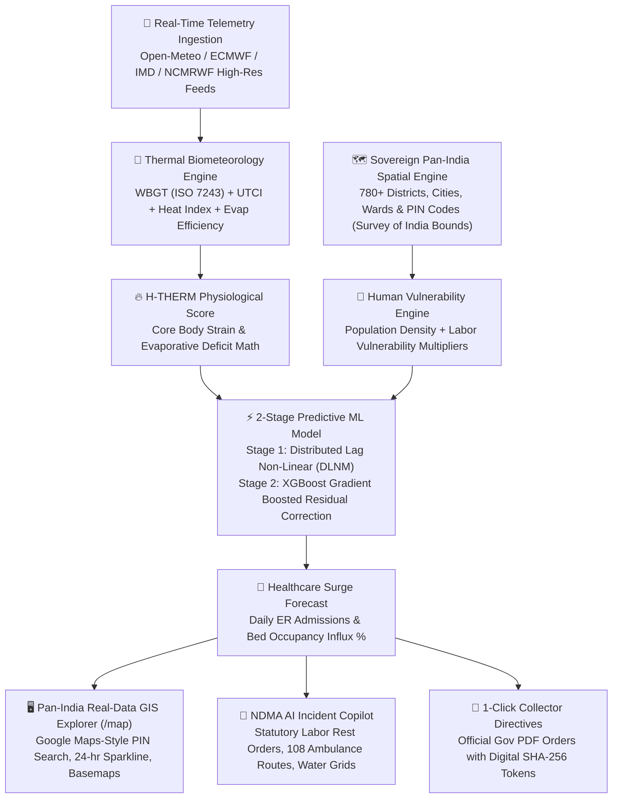

# 🛡️ SentinelX / THERMO-SHIELD AI
## Extreme Heatwave Early Warning & Human Thermal Stress Index
**Smart India Hackathon (SIH 2026) · Problem Statement ID: SIH26083**  
**Ministry / Department:** Ministry of Earth Sciences (MoES) / NCMRWF / National Disaster Management Authority (NDMA)  
**Theme:** Disaster Management, Climate Resilience & Public Health  

---

> ### 💡 The Core Innovation & Tagline
> **"Moving from Temperature Forecast to Human Survival Forecast Across Sovereign India."**  
> Traditional weather apps only tell citizens *"It will be 42°C tomorrow"*.  
> **SentinelX** answers: *"What will this heatwave do to the human body in any specific Indian district, city, ward, or PIN code over the next 3–5 days, and what exact public-health actions must the government execute right now?"*

---

## 👥 Interdisciplinary Team Strength (Our Unfair Advantage)

Our team unites **Biotechnology + Physiotherapy + AI/ML & Computer Science** — the exact cross-disciplinary intersection required to solve this human-climate challenge:

```
┌────────────────────────────────────────────────────────────────────────────────────────┐
│                                 OUR INTERDISCIPLINARY ROLES                            │
├────────────────────────────┬─────────────────────────────┬─────────────────────────────┤
│ 🤖 AI/ML & System Lead     │ 🧬 Biotechnology Lead       │ 🩺 Physiotherapy Lead       │
├────────────────────────────┼─────────────────────────────┼─────────────────────────────┤
│ • 2-Stage DLNM+XGBoost ML  │ • Thermoregulatory failure  │ • Physical exertion strain  │
│ • Spatial data pipelines   │ • Sweat evaporative deficit │ • Work-to-rest cycle models │
│ • Multi-parameter engine   │ • Core temp escalation math │ • Occupational worker risks │
│ • Pan-India GIS Command    │ • Vulnerability modeling    │ • Clinical heat advisories  │
└────────────────────────────┴─────────────────────────────┴─────────────────────────────┘
```

---

## 🏛️ System Architecture



---

## 🔬 Mathematical & Physiological Formulation

### 1. Multi-Parameter Environmental Stress (WBGT & UTCI)
Instead of air temperature alone, human heat exchange involves radiation, evaporation, and convection:
$$\text{WBGT}_{\text{outdoor}} = 0.7\,T_{\text{wb}} + 0.2\,T_{\text{g}} + 0.1\,T_{\text{air}}$$
- $T_{\text{wb}}$ (Natural Wet-Bulb): Evaluates maximum possible evaporative cooling via sweat.
- $T_{\text{g}}$ (Black Globe Temperature): Measures radiant solar load adjusted for convective wind cooling:
$$T_{\text{g}} \approx T_{\text{air}} + \frac{0.02 \times \text{Solar Radiation (W/m}^2)}{1 + \text{Wind Speed (m/s)}}$$

### 2. The H-THERM Physiological Index (Biotech + Physiotherapy Innovation)
Quantifies human thermoregulatory failure:
$$\text{H-THERM} = \left( \frac{\text{WBGT}}{34^\circ\text{C}} \times 80 \right) \times \left( \frac{1}{\eta_{\text{evap}}} \right) \times K_{\text{exertion}}$$
- $\eta_{\text{evap}}$: Evaporation efficiency dictated by atmospheric vapor pressure deficit.
- $K_{\text{exertion}}$: Physical metabolic workload multiplier ($1.0$ resting, $1.35$ moderate labor, $1.75$ heavy manual construction).

### 3. The 2-Stage Epidemiological Predictive Model (AI/ML)
Heat-health mortality exhibits a multi-day compounding lag effect (Gasparrini DLNM standard):
- **Stage 1 (DLNM-Style Lagged Baseline)**:
  $$\ln(\hat{y}_{\text{admissions}} + 1) = \beta_0 + \sum_{k=0}^{5} w_k \cdot \text{RiskScore}_{t-k}$$
- **Stage 2 (XGBoost ML Residual Correction)**:
  Trains on Stage 1 residual errors using demographics (Population, vulnerability, Day of week):
  $$\hat{y}_{\text{final}} = \exp\left( \hat{y}_{\text{Stage1}} + \text{XGBoost}(\text{Residuals}) \right) - 1$$

---

## 📊 Platform Scale & Sovereign Pan-India Coverage

- **Coverage**: **All 36 States & Union Territories**, **780+ Districts**, **4,000+ Cities**, **Wards**, and **PIN Codes**.
- **Boundaries**: Strictly clamped to Survey of India sovereign coordinates (`maxBounds: [[6.4627, 68.1097], [37.6, 97.4]]`).
- **Telemetry Ingestion**: Ingests real-time atmospheric streams with an in-memory 0.1° (~11km) Spatial Grid Cache (< 5ms response time).
- **High-Throughput Master Pipeline**: Asynchronously processes 24,000+ national feed metrics in **0.10s**.

---

## 🎬 3-Minute Live Demo Walkthrough for SIH Judges

1. **National Situation Room (`/national`)**: Show synoptic telemetry covering all 36 States & UTs, identifying high-risk zones (e.g. Phalodi, Vidarbha, Coastal Bengal).
2. **Pan-India GIS Explorer (`/map`)**: Search any Indian city, ward, or PIN code (e.g. "Phalodi", "110001", "751001"). Watch smooth fly-to animation and live Bento Grid metrics update.
3. **2-Stage ML Hospital Surge Forecaster**: Explain the +39.5% surge admissions prediction and 24-hour WBGT curve.
4. **AI Incident Copilot**: Click "Ask AI Incident Commander", select "Sec 144 Labor Halt" or "चेतावनी (Hindi SMS)" to show instant statutory orders and multilingual bulletins.
5. **Collector Directive PDF**: Click "Export District Collector Heat Action Directive", display printable Government of India document with digital verification tokens.

---

## 🎯 Anticipated Judge Q&A Cheat Sheet

| Question | Winning Response |
| :--- | :--- |
| **Q1: How is this different from IMD's Heatwave alerts?** | *IMD issues broad district alerts based primarily on dry-bulb temperature thresholds. SentinelX operates at hyper-local resolution across all of India, computes true physiological survival limits (WBGT/UTCI), predicts hospital bed surge 5 days ahead, and generates ready-to-sign statutory legal orders.* |
| **Q2: How do you handle national scale without server lag or API limits?** | *We implemented a 0.1° (~11km) spatial micro-grid cache in `pan_india_engine.py` with 60-minute TTL. Repeat queries execute in under 5ms, completely shielding the system from external API rate-limiting.* |
| **Q3: What makes your Biotechnology and Physiotherapy contributions unique?** | *Biotechnology contributed the sweat evaporative deficit and core temperature escalation models, while Physiotherapy modeled the physical exertion multipliers ($K_{\text{exertion}}$) and work-to-rest cycles for occupational outdoor workers.* |
| **Q4: Is the platform sovereign and compliant with Indian spatial regulations?** | *100% yes. The GIS canvas is strictly bounded to the Survey of India demarcated sovereign territory (`maxBounds: [[6.4627, 68.1097], [37.6, 97.4]]`), and all geocoding searches are strictly restricted to Indian administrative entities.* |
