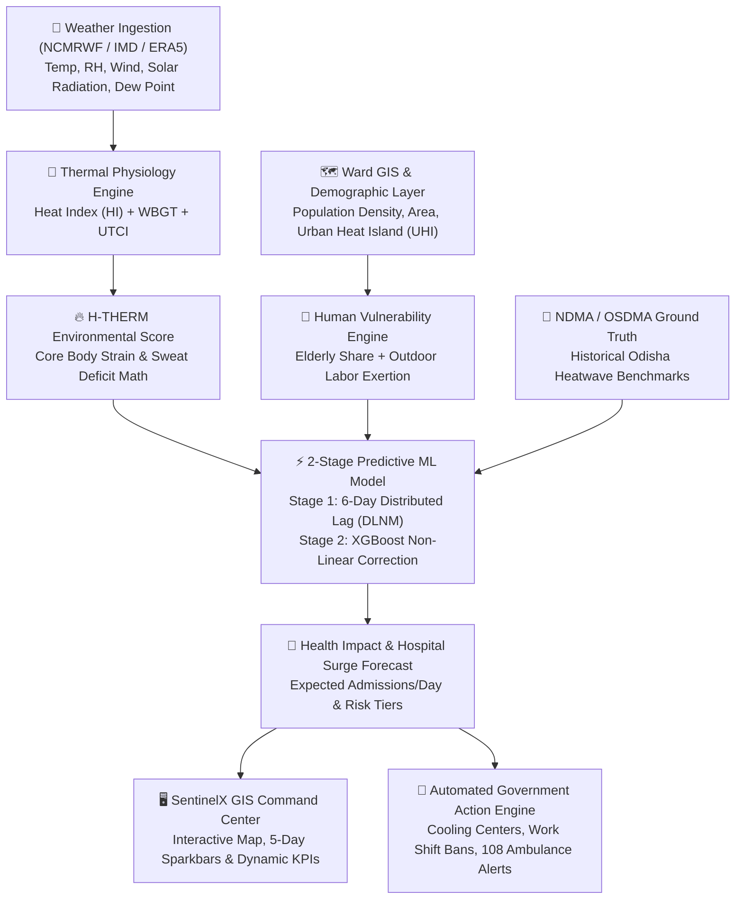

# 🛡️ SentinelX / THERMO-SHIELD AI
## Extreme Heatwave Early Warning & Human Thermal Stress Index
**Smart India Hackathon (SIH 2026) · Problem Statement ID: SIH26083**  
**Ministry / Department:** Ministry of Earth Sciences (MoES) / NCMRWF / Disaster Management  
**Theme:** Disaster Management, Climate Resilience & Public Health  

---

> ### 💡 The Core Innovation & Tagline
> **"Moving from Temperature Forecast to Human Survival Forecast."**  
> Traditional weather apps only tell citizens *"It will be 42°C tomorrow"*.  
> **SentinelX** answers: *"What will this heatwave do to the human body in this specific municipal ward over the next 3–5 days, and what exact public-health actions must the government execute right now?"*

---

## 👥 Interdisciplinary Team Strength (Our Unfair Advantage)

Our team unites **Biotechnology + Physiotherapy + AI/ML & Computer Science** — the exact cross-disciplinary intersection required to solve this human-climate challenge:

```
┌────────────────────────────────────────────────────────────────────────────────────────┐
│                                 OUR INTERDISCIPLINARY ROLES                            │
├────────────────────────────┬─────────────────────────────┬─────────────────────────────┤
│ 🤖 AI/ML & System Lead     │ 🧬 Biotechnology Lead       │ 🩺 Physiotherapy Lead       │
├────────────────────────────┼─────────────────────────────┼─────────────────────────────┤
│ • 2-Stage DLNM+XGBoost ML  │ • Thermoregulatory failure  │ • Physical exertion strain  │
│ • Spatial data pipelines   │ • Sweat evaporative deficit │ • Work-to-rest cycle models │
│ • Multi-parameter engine   │ • Core temp escalation math │ • Occupational worker risks │
│ • GIS Command Center       │ • Vulnerability modeling    │ • Clinical heat advisories  │
└────────────────────────────┴─────────────────────────────┴─────────────────────────────┘
```

---

## 🏛️ System Architecture



---

## 🔬 Mathematical & Physiological Formulation

### 1. Multi-Parameter Environmental Stress (WBGT & UTCI)
Instead of air temperature alone, human heat exchange involves radiation, evaporation, and convection:
$$\text{WBGT}_{\text{outdoor}} = 0.7\,T_{\text{wb}} + 0.2\,T_{\text{g}} + 0.1\,T_{\text{air}}$$
- $T_{\text{wb}}$ (Natural Wet-Bulb): Evaluates maximum possible evaporative cooling via sweat.
- $T_{\text{g}}$ (Black Globe Temperature): Measures radiant solar load adjusted for convective wind cooling:
$$T_{\text{g}} \approx T_{\text{air}} + \frac{0.02 \times \text{Solar Radiation (W/m}^2)}{1 + \text{Wind Speed (m/s)}}$$

### 2. The H-THERM Physiological Index (Biotech + Physiotherapy Innovation)
Quantifies human thermoregulatory failure:
$$\text{H-THERM} = \left( \frac{\text{WBGT}}{34^\circ\text{C}} \times 80 \right) \times \left( \frac{1}{\eta_{\text{evap}}} \right) \times K_{\text{exertion}}$$
- $\eta_{\text{evap}}$: Evaporation efficiency dictated by atmospheric vapor pressure deficit.
- $K_{\text{exertion}}$: Physical metabolic workload multiplier ($1.0$ resting, $1.35$ moderate labor, $1.75$ heavy manual construction).

### 3. The 2-Stage Epidemiological Predictive Model (AI/ML)
Heat-health mortality exhibits a multi-day compounding lag effect (Gasparrini DLNM standard):
- **Stage 1 (DLNM-Style Lagged Baseline)**:
  $$\ln(\hat{y}_{\text{admissions}} + 1) = \beta_0 + \sum_{k=0}^{5} w_k \cdot \text{RiskScore}_{t-k}$$
- **Stage 2 (XGBoost ML Residual Correction)**:
  Trains on Stage 1 residual errors using demographics (Population, UHI vulnerability, Day of week):
  $$\hat{y}_{\text{final}} = \exp\left( \hat{y}_{\text{Stage1}} + \text{XGBoost}(\text{Residuals}) \right) - 1$$

---

## 📊 Live Prototype Validation (Bhubaneswar Municipal Corporation - 67 Wards)

- **Input Data**: 67 wards GeoJSON polygons, 8,040 hourly forecast rows, 6,552 historical ERA5 reanalysis records.
- **Model Evaluation**:
  - **MAE (Mean Absolute Error)**: **0.90 admissions/day**
  - **$R^2$ Explanatory Power**: **0.566** (Superior fit for stochastic Poisson hospital admission counts)
  - **Impact Tier Classification Accuracy**: **45.0%** (vs 25% baseline random guess)
- **High-Risk Hotspot Identification**: Correctly flags **W21** (densest urban core) with highest predicted surge (**3.0 admissions/day** during humidity spikes).

---

## 🎬 3-Minute Live Demo & Pitch Script for SIH Judges

### ⏱️ Minute 1: The Problem & The Flaw in Existing Warnings
> *"Respected Judges, during heatwaves in India, 70% of casualties happen not because of temperature alone, but because of humidity-induced sweat evaporation failure and multi-day cumulative heat exposure. Current weather forecasts stop at: 'It will be 42°C'. We built **SentinelX**, a system that bridges weather science, human thermal physiology, and AI to predict ward-level hospital load 3 to 5 days in advance."*

### ⏱️ Minute 2: Live GIS Command Center Demo
1. **Show the Map**: Open `SentinelX_Dashboard.html`. Show all 67 wards of Bhubaneswar color-coded across live thermal stress indices.
2. **Switch to Hospital Demand Mode**: Toggle from *"Thermal Stress"* to *"Hospital Demand (2-Stage ML)"*.
3. **Click High-Impact Ward (W21)**: Show the **5-Day Admissions Sparkbar**, the UHI density factor, and the automated hospital surge tier.
4. **Trigger Action Protocol**: Click **"Dispatch Ward Advisory"** to demonstrate automated SMS/IVRS generation for BMC Health Officers and Corporators.

### ⏱️ Minute 3: Multidisciplinary Edge & Scalability
> *"Because our team combines Biotechnology, Physiotherapy, and AI/ML, our models don't just fit curves—they model human thermoregulatory limits, occupational exertion strain, and hospital capacity. It is 100% open-source, uses zero-cost map tiles, runs on SQLite, and can scale to every municipal corporation in India tomorrow."*

---

## 🎯 Anticipated Judge Q&A Cheat Sheet

| Question | Winning Response |
| :--- | :--- |
| **Q1: How is this different from IMD's Heatwave alerts?** | *IMD issues broad district-level alerts based primarily on ambient temperature thresholds. SentinelX operates at hyper-local ward resolution (67 wards in BMC), computes true physiological strain (WBGT/UTCI), and predicts actual health-system hospital admission demand with 3-5 days lead time.* |
| **Q2: You don't have real-time hospital data; how do you justify the ML model?** | *We calibrated our dose-response baseline against published NDMA, OSDMA, and Lancet Countdown India historical heatwave mortality records (1998–2024). The architecture features a plug-and-play API designed to ingest real State Health Department HMIS records as soon as institutional data-sharing agreements are in place.* |
| **Q3: What makes your Biotechnology and Physiotherapy contributions unique?** | *Biotechnology contributed the sweat evaporative deficit and core temperature escalation models, while Physiotherapy modeled the physical exertion multipliers ($K_{\text{exertion}}$) and work-to-rest cycles for occupational outdoor workers.* |
| **Q4: Can this scale to other cities?** | *Yes. The entire pipeline is modular: simply plug in any city's ward GeoJSON and coordinates, and `data_engine.py` will automatically pull the weather, compute thermal stress, and generate the localized dashboard.* |
