# SENTINELX SYSTEM ARCHITECTURE
**Date:** 2026-09-25

## 1. High-Level Architecture Diagram

```mermaid
graph TD
    Browser["Browser (React/Vite SPA)"] -->|fetch JSON| FastAPI["FastAPI Master Node (main.py)"]
    
    FastAPI -->|serve static HTML/JS/CSS| ReactDist["dist/"]
    FastAPI -->|lifespan context| BackgroundServices["Background Sync Daemon"]
    
    %% API Routers
    FastAPI --> RouterSentinel["routers/sentinelx.py"]
    FastAPI --> RouterAlerts["routers/alerts.py"]
    FastAPI --> RouterWeather["routers/weather.py"]
    FastAPI --> RouterHistorical["routers/historical_replay.py"]
    
    %% Background Daemon Threads (services/live_sync.py)
    BackgroundServices -.->|Thread 1: 900s| IMD["IMD Warning Scraper"]
    BackgroundServices -.->|Thread 2: 900s| CPCB["CPCB AQI API"]
    BackgroundServices -.->|Thread 3: 600s| OpenMeteoPoll["Open-Meteo Current Weather"]
    
    IMD -.-> SQLite["sentinelx_data.db (SQLite)"]
    CPCB -.-> SQLite
    OpenMeteoPoll -.-> SQLite
    
    %% Data retrieval pathways
    RouterSentinel -->|/live-feed| LiveFeed["services/ingestion.py"]
    LiveFeed --> SQLite
    
    RouterSentinel -->|/ml-v2/forecast| MLForecast["ml_v2/live_features.py"]
    MLForecast -->|on-demand past_hours=25| OpenMeteoOnDemand["Open-Meteo Hourly History"]
    MLForecast --> Inference["ml_v2/inference.py"]
    Inference --> ModelArtifact["data/ml_v2/models/ml_v2_model.joblib"]
    
    RouterSentinel -->|/map/era5| ERACSV["data/ml_v2/era5_grid_mapping.csv"]
    
    RouterSentinel -->|/physiology-reference| PhysioNet["services/physiology_reference.py"]
    PhysioNet --> WearableDataset["data/wearable-device-dataset-1.0.1/"]
    
    RouterSentinel -->|/alerts/dispatch| AlertDispatch["services/alerts.py"]
    AlertDispatch --> Twilio["Twilio / Fast2SMS API"]
    
    %% Risk Engine and Hazard calculation
    FastAPI --> RiskRules["core/risk_rules.py"]
    RiskRules --> ThermalStress["core/thermal_stress.py"]
    RiskRules --> MultiHazard["services/live_multihazard.py"]
    
    %% Historical Data
    FastAPI -->|/benchmarks| NDMAData["NDMA Heatwave Database"]
    
    %% Styling
    classDef external fill:#f9f,stroke:#333,stroke-width:2px;
    classDef storage fill:#ff9,stroke:#333,stroke-width:2px;
    classDef core fill:#bbf,stroke:#333,stroke-width:2px;
    
    class OpenMeteoPoll,OpenMeteoOnDemand,IMD,CPCB,Twilio external;
    class SQLite,ModelArtifact,WearableDataset,ERACSV,NDMAData storage;
    class FastAPI,RouterSentinel,MLForecast,RiskRules core;
```

## 2. Core Subsystems

### A. Telemetry & Ingestion
- **Database:** `sentinelx_data.db` (SQLite)
- **Engine:** `services/live_sync.py` and `services/ingestion.py`
- **Behavior:** Background daemon threads spawn on FastAPI lifespan start, continuously polling IMD, CPCB, and Open-Meteo. The data is normalized and stored with UTC timestamps. Duplicate reads are prevented via unique `ward_id` + `observed_at` indices.

### B. Machine Learning (V2)
- **Training Pipeline:** `scripts/train_ml_v2.py`
- **Data Source:** Copernicus ECMWF ERA5 (Historical Reanalysis, 2021-2025)
- **Model:** HistGradientBoosting (R² 0.9055 on untouched 2025 Test data)
- **Inference Pipeline:** `ml_v2/inference.py` loaded via `/api/v1/ml-v2/forecast`. Requires exactly 25 completed hourly observations dynamically fetched from Open-Meteo on-demand. Excludes the current incomplete hour to guarantee causality.

### C. Hazard & Risk Engine
- **Engine:** `core/risk_rules.py` and `core/thermal_stress.py`
- **Behavior:** Fully deterministic, stateless risk rule engine evaluating live conditions against explicit thresholds defined in `config/thresholds.py`. Integrates dynamically with `services/live_multihazard.py` which scrapes active external disaster feeds (CWC, GSI, NDMA).

### D. Frontend Interface
- **Framework:** React 18, Vite, TailwindCSS v4
- **Routing:** Handled entirely client-side via React Router. The backend FastAPI serves a catchall route `/{catchall:path}` that falls back to `index.html`.
- **Telemetry Display:** Polls `/api/v1/live-feed` at regular intervals to drive the main command dashboards.

## 3. Data Flow Guarantees

1. **Causality:** ML V2 guarantees causal predictions by structurally rejecting the current (t) hour and predicting the maximum apparent temperature from t+1 to t+24.
2. **Graceful Degradation:** If external live source APIs (Open-Meteo) fail or timeout, the ML V2 endpoint degrades to a `DATA_UNAVAILABLE` status, preventing the display of fabricated data.
3. **Cross-Source Awareness:** Due to training on ECMWF ERA5 and inferencing on Open-Meteo, the `live_features.py` module explicitly labels its output with `source_alignment = NOT_EXACT` to maintain rigorous scientific provenance tracking.
