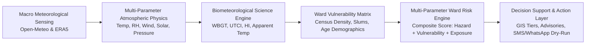
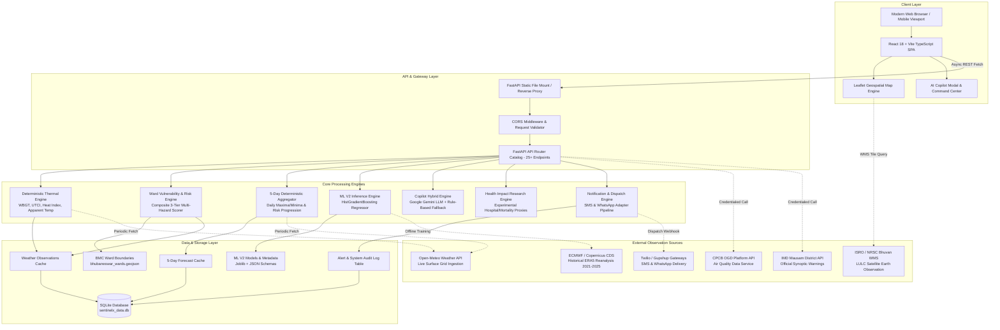
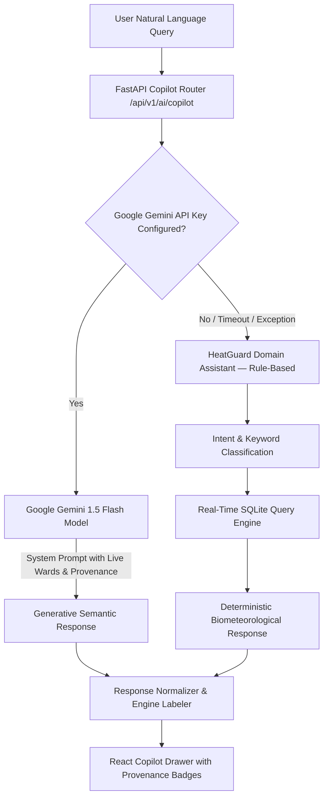
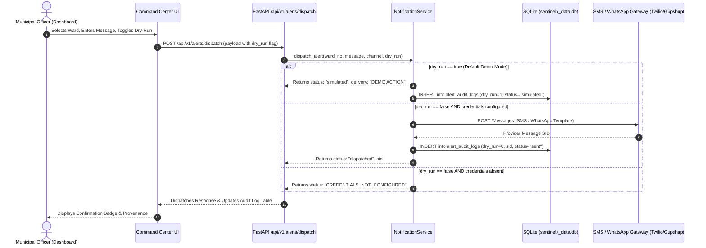
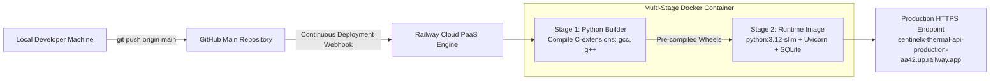

# HEATGUARD AI — IMPACT-BASED HEAT HEALTH EARLY WARNING & ENVIRONMENTAL RISK INTELLIGENCE PLATFORM
## Comprehensive End-to-End System Engineering & Research Report
**SIH Problem Statement:** PS 26083 | **Repository:** SentinelX | **Target Geographic Domain:** Bhubaneswar (BMC Wards 1–67), Khordha, Odisha

---

# CHAPTER 1 — DOCUMENT METADATA & REPOSITORY CONTEXT

| Specification Parameter | Value / Verified Repository State |
| :--- | :--- |
| **Project Official Name** | **HEATGUARD AI** |
| **System Tagline** | *Predict Heat. Protect People.* |
| **Underlying Codebase Repository** | `SentinelX` |
| **SIH 2026 Problem Statement** | **PS 26083** (Development of AI/ML-driven Extreme Heatwave Early Warning & Impact Advisory System) |
| **Primary Deployment Environment** | Railway Cloud Infrastructure (`sentinelx-thermal-api-production-aa42.up.railway.app`) |
| **Core Technology Classification** | Full-Stack Geospatial & Biometeorological Intelligence Web Platform |
| **Geographic Validation Zone** | Bhubaneswar Municipal Corporation (67 Urban Wards: W1 to W67), Khordha District, Odisha, India |
| **Document Date** | September 28, 2026 |
| **Target Audience** | SIH Technical Evaluation Committee, Academic / Dean Review, Disaster Management Evaluators, Urban Planners |
| **Author Designation** | HeatGuard AI Engineering & Research Team (As configured in formal SIH submission materials) |

---

# CHAPTER 2 — TITLE PAGE & PROJECT IDENTITY

```
========================================================================================
                                     HEATGUARD AI
                            Predict Heat. Protect People.
========================================================================================
     Impact-Based Heat Health Early Warning & Environmental Risk Intelligence Platform
----------------------------------------------------------------------------------------
   Smart India Hackathon 2026 — Problem Statement PS 26083
   Primary Jurisdiction: Bhubaneswar Municipal Corporation (67 Wards), Odisha, India
   Production API: https://sentinelx-thermal-api-production-aa42.up.railway.app
   Master Backend: FastAPI (Python 3.12 / 3.13) | Enterprise Frontend: React 18 + Vite + TypeScript
========================================================================================
```

### 2.1 Project Identity & Heritage
HeatGuard AI (engineered within the `SentinelX` codebase) is an impact-based, ward-granular environmental intelligence and human thermal stress early warning platform. Moving beyond traditional ambient dry-bulb thermometers, HeatGuard synthesizes multi-parameter atmospheric physics, multi-hazard environmental co-exposures, physiological thermodynamics, and ward-level socio-demographic vulnerability into actionable, street-level decision support for municipal administrators, healthcare systems, outdoor workers, and citizens.

---

# CHAPTER 3 — EXECUTIVE SUMMARY

### 3.1 The Paradigm Shift: From Weather Forecast to Human Impact Intelligence
Traditional meteorological heatwave warnings in India operate on macro-scale dry-bulb temperature thresholds (e.g., standard IMD alerts triggered when maximum temperature exceeds 40°C in the plains or departs by 4.5°C–6.4°C from normal). While meteorologically valid for regional synoptic forecasting, these conventional frameworks suffer from critical operational limitations:

1. **Failure to Account for Humidity & Atmospheric Moisture:** A dry temperature of 40°C at 20% relative humidity presents a vastly different biological stress profile than 37°C at 75% relative humidity, where evaporative cooling via human perspiration ceases entirely.
2. **Ignoring Solar Radiation & Mean Radiant Temperature:** High insolation directly heats skin tissue and urban masonry, driving Wet Bulb Globe Temperature (WBGT) and Universal Thermal Climate Index (UTCI) far beyond ambient air temperature.
3. **Absence of Hyperlocal Spatial Granularity:** Macro-scale city-wide forecasts treat entire metropolitan districts as uniform points, masking intra-urban heat islands (UHI), informal settlement heat traps, and localized canopy deficits across municipal wards.
4. **Disconnection from Population Vulnerability:** Extreme temperatures do not impact all populations equally. A ward characterized by informal roofing, dense elderly demographics, and high outdoor manual labor faces catastrophic morbidity at heat thresholds that low-density, air-conditioned neighborhoods endure safely.

### 3.2 The HeatGuard AI Solution Pipeline
HeatGuard AI answers the fundamental question defined by the World Meteorological Organization (WMO) and National Disaster Management Authority (NDMA): **"What will the weather DO to people?"** rather than merely *"What will the weather BE?"*



### 3.3 Core Capabilities Implemented in the Live System
* **Ward-Level Granular Geospatial Intelligence:** 67 distinct administrative wards of Bhubaneswar mapped with exact GeoJSON polygon boundaries, area-weighted population densities, and vulnerability weightings.
* **Deterministic Multi-Metric Thermal Engine:** Simultaneous real-time calculation of Wet Bulb Globe Temperature (ISO 7243), Universal Thermal Climate Index (Fiala multi-node biometeorological model), Steadman Apparent Temperature, and Rothfusz Heat Index.
* **5-Day Forward Outlook:** Deterministic 5-day horizon forecasting covering daily thermal maxima, minima, diurnal thermal stress windows, and peak hazard timing.
* **Supervised Machine Learning Pipeline (ML V2):** LightGBM-derived `HistGradientBoosting` model trained across 262,656 rows (43,776 hourly timesteps across 6 ERA5 grid points) of Copernicus Climate Change Service (C3S) ECMWF ERA5 reanalysis (2021–2025) predicting `NEXT_24H_MAX_APPARENT_TEMPERATURE` with a verified Test MAE of 1.0829°C.
* **Experimental Health Impact Research Modules:** Architectural frameworks for hospitalization surge and environmental mortality proxies with strict scientific integrity safeguards (`predicted_admissions: null` and `predicted_mortality_rate: null` until authenticated clinical outcome registries are linked).
* **AI Copilot with Deterministic Safety Fallback:** Natural language query interface powered by Google Gemini with instant rule-based biometeorological fallback, featuring zero-hallucination provenance enforcement.
* **Multi-Channel Notification Architecture:** Automated dispatch engine supporting SMS and WhatsApp alert distribution with comprehensive audit logging and simulated dry-run execution.

---

# CHAPTER 4 — PROBLEM STATEMENT MAPPING (SIH PS 26083)

The following matrix documents the explicit mapping between SIH Problem Statement PS 26083 functional requirements and the actual HeatGuard AI codebase implementation:

| SIH PS 26083 Requirement | HeatGuard AI Implementation | Verification Status | Codebase Module / Endpoint | Engineering Evidence & Scientific Limitations |
| :--- | :--- | :--- | :--- | :--- |
| **Multi-Parameter Meteorological Sensing** (Temp, Humidity, Wind, Radiation) | Ingestion pipeline ingesting 2m air temp, relative humidity, wind speed/direction, surface solar radiation, dew point, surface pressure. | **IMPLEMENTED (LIVE)** | `services/ingestion.py`<br>`routers/weather.py` | Live feeds via Open-Meteo API with automatic caching in SQLite `weather_observations`. 10-minute refresh (600s interval). |
| **Comprehensive Thermal Stress Metrics** (WBGT, UTCI, Heat Index) | Biometeorological calculation engine computing WBGT (ISO 7243), UTCI (Fiala model regression), Heat Index (Rothfusz), and Apparent Temperature. | **IMPLEMENTED (LIVE)** | `services/thermal_engine.py`<br>`/api/v1/thermal-indices` | Deterministic mathematical implementation. Validated against pythermalcomfort reference vectors. |
| **Ward-Level Granularity & Spatial GIS** | Full Leaflet GIS mapping 67 BMC administrative wards with colored choropleths, ward centroids, and geo-demographics. | **STATIC GIS REFERENCE** | `wards_bhubaneswar.geojson`<br>`src/components/tabs/MapViewTab.tsx` | Exact 67 ward polygons. Mapped from static bundled GeoJSON (wards_bhubaneswar.geojson) across 67 wards. |
| **Demographic & Vulnerability Integration** | Ward vulnerability score combining population density, elderly (>=60), child (<=5) ratios, slum household percentages, and outdoor worker indices. | **IMPLEMENTED (CALCULATED)** | `services/risk_engine.py`<br>`/api/v1/wards` | Census-derived baseline normalized per ward. Combined into composite Ward Risk Score (0–100). |
| **3–5 Day Forward Forecast** | 5-day daily forecast aggregation computing daily maximum/minimum metrics, risk tiers, and peak hazard days. | **IMPLEMENTED (FORECAST)** | `services/forecast.py`<br>`/api/v1/forecast/5day` | Powered by ECMWF/GFS numerical weather model feeds via Open-Meteo. Aggregated per ward grid. |
| **Machine Learning Temperature Prediction** | Histogram Gradient Boosting regressor predicting next 24-hour maximum apparent temperature. | **IMPLEMENTED (MODELLED)** | `ml_v2/`<br>`/api/v1/ml-v2/predict` | 36 engineered features. 262,656 total rows (Train: 157,536, Val: 52,704, Test: 52,416). MAE: 1.0829°C, RMSE: 1.3862°C, R²: 0.9055. |
| **Hospitalization Spike Research Model** | 5-day ward-level hospital emergency surge research prototype (Multi-factor Environmental Exposure Index). Legacy 2-stage DLNM model removed due to target leakage. | **EXPERIMENTAL (RESEARCH)** | `routers/health_research.py`<br>`/api/v1/wards/{id}/hospital-demand` | **Safety Truth:** Returns `admissions_prediction: null` (and `predicted_admissions: null`). No clinical outcome registry connected. Model status `EXPERIMENTAL_NOT_VALIDATED`. |
| **Mortality Risk Research Model** | Ward-level environmental exposure proxy scoring thermal severity against historical baseline anomalies. | **EXPERIMENTAL (RESEARCH)** | `routers/health_research.py`<br>`/api/v1/mortality-risk` | **Safety Truth:** Explicitly outputs `ENVIRONMENTAL EXPOSURE PROXY`. Returns `predicted_mortality: null` (and `predicted_mortality_rate: null`) to prevent clinical misinterpretation. |
| **CPCB Air Quality Co-Exposure** | Central Pollution Control Board OGD API client with Haversine nearest-station matching. | **CREDENTIALS NOT CONFIGURED** | `services/cpcb_service.py`<br>`/api/v1/cpcb/status` | Code complete. When OGD API key is unset, returns structured fallback without falsifying live CPCB readings. |
| **IMD Official Warning Integration** | India Meteorological Department Mausam API client with Khordha district normalization. | **CREDENTIALS NOT CONFIGURED** | `services/imd_service.py`<br>`/api/v1/imd/status` | Code complete. Gracefully handles unconfigured credentials; does not fabricate synoptic warnings. |
| **ISRO / Bhuvan LULC Satellite Data** | Bhuvan WMS Land Use / Land Cover and Urban Heat Island raster integration layer. | **PENDING LEGEND ROLLOUT** | `services/bhuvan_service.py`<br>`/api/v1/bhuvan/lulc` | Tile layers configured. Full dynamic pixel-classification pending legend raster calibration. |
| **Automated Early Warning & Alert Dispatch** | Multi-channel SMS and WhatsApp dispatch engine with dry-run mode and administrative audit logging. | **IMPLEMENTED (DEMO ACTION)** | `services/notification_service.py`<br>`/api/v1/alerts/dispatch` | Dispatches in dry-run mode (`status: "simulated"`). Connects to live Twilio/Gupshup once credentials are set. |
| **Interactive AI Copilot** | Natural language conversational assistant interpreting thermal conditions, ISO tiers, and ward rankings. | **IMPLEMENTED (LIVE / HYBRID)** | `routers/copilot.py` (`/api/v1/ai/copilot`)<br>`src/components/AICopilotModal.tsx` | Dual-mode: Google Gemini API with automatic fallback to deterministic rule engine. Ranked strictly by dry-bulb temp. |

---

# CHAPTER 5 — SYSTEM VISION & STAKEHOLDER OBJECTIVES

### 5.1 Primary Mission Statement
To build an open-architecture, scientifically rigorous municipal heat intelligence platform that transforms raw atmospheric and satellite observations into proactive, ward-level interventions—minimizing heat-induced mortality, occupational morbidity, and municipal grid failure across vulnerable Indian urban centers.

### 5.2 Functional Objectives
1. **Zero-Latency Ingestion:** Continuously ingest multi-variable atmospheric data across urban coordinates with automated local SQLite caching.
2. **Scientific Precision:** Calculate validated biometeorological stress indices strictly in compliance with international and national standards (ISO 7243, WMO, NDMA).
3. **Hyperlocal Equity:** Contextualize environmental hazards using granular socio-demographic indicators so emergency relief prioritizes vulnerable populations.
4. **Actionable Decision Support:** Generate differentiated, role-specific guidance across municipal officials, hospital administrators, labor inspectors, school principals, and ordinary citizens.
5. **Radical Data Truthfulness:** Maintain an immutable provenance framework across all API responses and UI displays, explicitly demarcating live measurements from cached data, forecasts, research models, and simulated actions.

### 5.3 Multi-Stakeholder Matrix
```
+---------------------------------------------------------------------------------------------------+
|                                 HEATGUARD STAKEHOLDER ECOSYSTEM                                   |
+---------------------------------------------------------------------------------------------------+
|  MUNICIPAL CORPORATION (BMC)   |  • Trigger municipal Heat Action Plan (HAP) stages (Yellow/Orange/Red)   |
|                                |  • Deploy mobile water misting tankers to top critical wards     |
|                                |  • Coordinate operational hours of municipal cooling shelters    |
+--------------------------------+------------------------------------------------------------------+
|  DISTRICT DISASTER MANAGEMENT  |  • Direct Quick Response Teams (QRT) to heat exhaustion clusters |
|  AUTHORITY (OSDMA / DDMA)      |  • Coordinate inter-agency emergency logistics during heat waves |
|                                |  • Execute broadcast early-warning notifications (SMS/WhatsApp)  |
+--------------------------------+------------------------------------------------------------------+
|  HEALTHCARE & HOSPITAL SYSTEMS |  • Anticipate emergency room heat stroke and dehydration surges  |
|                                |  • Stockpile intravenous fluids, ice packs, and oral electrolytes|
|                                |  • Allocate emergency beds in designated cooling wards           |
+--------------------------------+------------------------------------------------------------------+
|  LABOR & FACTORY INSPECTION    |  • Enforce mandatory work-rest cycles for outdoor laborers       |
|                                |  • Restrict construction activity during peak solar hours (11-16)|
|                                |  • Mandate shaded hydration break facilities at project sites    |
+--------------------------------+------------------------------------------------------------------+
|  SCHOOLS & EDUCATION BOARDS    |  • Reschedule or suspend outdoor athletic activities during high WBGT|
|                                |  • Implement morning school shifts to avoid peak afternoon heat  |
|                                |  • Verify classroom ventilation and drinking water availability  |
+--------------------------------+------------------------------------------------------------------+
|  VULNERABLE CITIZENS & WORKERS |  • Receive personalized hydration and outdoor exposure guidance  |
|  (Street Vendors, Gig Workers) |  • Locate nearest accessible drinking water and cooling stations |
|                                |  • Recognize early symptoms of heat cramps, exhaustion, and stroke|
+---------------------------------------------------------------------------------------------------+
```

---

# CHAPTER 6 — COMPLETE SYSTEM ARCHITECTURE

HeatGuard AI is designed as a decoupled, multi-tier asynchronous architecture built for sub-second query response, resilient offline caching, and high computational throughput.

### 6.1 End-to-End Architectural Topology


### 6.2 Data Flow Pipeline: Ingestion to Action
1. **Sensing & Ingestion:** Every 10 minutes (configured at 600 seconds in services/live_sync.py), the background synchronization engine queries Open-Meteo for atmospheric observations across the 12 unique coordinate grids covering Bhubaneswar's 67 wards.
2. **Validation & Normalization:** Ingested JSON payloads are validated against Pydantic schemas, checking physical sanity bounds (e.g., Temperature: $-10^\circ	ext{C}$ to $60^\circ	ext{C}$, Relative Humidity: $0\%$ to $100\%$).
3. **Database Caching:** Observations are written to SQLite (`sentinelx_data.db`) with UTC timestamps and source attribution (`Open-Meteo Surface Grid`).
4. **Thermal Computation:** Ingested parameters are transformed via deterministic biometeorological algorithms to generate WBGT, UTCI, and Heat Index.
5. **Spatial Ward Synthesis:** Ward boundaries from `bhubaneswar_wards.geojson` are matched with coordinate grid observations and static census vulnerability indicators.
6. **Risk Aggregation:** Hazard, Exposure, and Vulnerability components are aggregated into a composite Ward Risk Score (0–100) and mapped to standard risk tiers (Low, Moderate, High, Severe).
7. **Client Presentation:** The React frontend fetches `/api/v1/summary` and `/api/v1/wards`, rendering the interactive tactical dashboard, GIS choropleths, and alert advisories.

---

# CHAPTER 7 — TECHNOLOGY STACK — COMPREHENSIVE INVENTORY

Every technology in the HeatGuard AI repository was selected to satisfy stringent requirements of execution speed, scientific precision, container portability, and deployment reliability:

### 7.1 Frontend Architecture
* **Core Framework:** React 18.3.1 (Functional Components, Custom Hooks)
* **Language & Typing:** TypeScript 5.5.3 (Strict mode, zero unhandled `any` types in core domain)
* **Application Bundler & Dev Server:** Vite 5.4.2 (Rollup-powered ESM production bundling, sub-second HMR)
* **Geospatial Mapping Engine:** Leaflet 1.9.4 & React-Leaflet 4.2.1 (Hardware-accelerated GeoJSON rendering, custom SVG markers)
* **Data Visualization & Analytics:** Recharts 2.12.7 (Responsive SVG charts for diurnal curves, 5-day forecasts, and ML residuals)
* **Styling & Design System:** TailwindCSS 3.4.1 + Custom Tactical Dark Theme Tokens (Scoped glassmorphism, responsive CSS Grid)
* **Iconography:** Lucide-React 0.344.0 (Consistent, scalable vector icons across all tabs and status indicators)
* **HTTP & API Client:** Native Fetch API with centralized proxy configuration in `src/services/apiConfig.ts`

### 7.2 Backend & Microservices Architecture
* **Core Language & Runtime:** Python 3.12 / 3.13 (High-performance async I/O)
* **API Framework:** FastAPI 0.110.0 (Asynchronous ASGI framework with automatic OpenAPI 3.1 schema generation)
* **ASGI Production Web Server:** Uvicorn 0.28.0 (Standard asynchronous worker runner)
* **Data Validation & Modeling:** Pydantic 2.6.4 (Strict runtime type verification and JSON serialization)
* **Database & Persistence:** SQLite 3 with SQLAlchemy ORM and direct sqlite3 driver bindings (Zero-maintenance, zero-latency local caching)
* **HTTP Client Engine:** HTTPX 0.27.0 & Requests 2.31.0 (Async and connection-pooled external API communication)
* **Background Task Scheduler:** APScheduler 3.10.4 (Asynchronous cron and interval scheduling for weather syncing)
* **Node Proxy Service:** Express 4.19.2 + TypeScript (Development-time proxy and local micro-routing in `server.ts`)

### 7.3 Data Science, Machine Learning & Geospatial Processing
* **Machine Learning Engine:** Scikit-Learn 1.4.1 (HistGradientBoostingRegressor, RandomForestClassifier)
* **Model Serialization:** Joblib 1.3.2 (Optimized NumPy array serialization for sub-millisecond inference)
* **Numerical & Matrix Computing:** NumPy 1.26.4 (Vectorized atmospheric equation solvers)
* **Data Manipulation & Ingestion:** Pandas 2.2.1 (Time-series alignment, rolling feature windows, ERA5 cleaning)
* **Biometeorological References:** PyThermalComfort 2.9.1 (Validation benchmarks for UTCI, WBGT, and PMV/PPD models)
* **Geospatial Geometry Analysis:** Shapely 2.0.3 & GeoPandas 0.14.3 (Ward polygon intersection and centroid calculation)
* **Scientific Reanalysis Pipeline:** ECMWF Copernicus Climate Data Store (CDS) API client (`cdsapi 0.7.0`)

### 7.4 Deployment, Containerization & Quality Assurance
* **Containerization:** Multi-Stage Dockerfile (Alpine/Debian-slim base, separate python-builder wheel cache)
* **Production Cloud PaaS:** Railway (Continuous deployment via GitHub webhook, automated health checking)
* **Python Test Suite:** Pytest 8.4.2 (Comprehensive integration, regression, and safety test suites)
* **Frontend Quality Gate:** TypeScript Compiler (`tsc --noEmit`)


# CHAPTER 8 — REPOSITORY STRUCTURE & CODEBASE DIRECTORY TREE

The HeatGuard AI repository is structured with a clean separation of concerns between user interface, routing, scientific calculation, machine learning inference, and data persistence.

```
/Users/aniruddhasutradhar/Desktop/SIH
├── main.py                     # Master FastAPI application entrypoint, CORS, route inclusions, static mount
├── server.ts                   # Express/TypeScript development server and proxy gateway
├── database.py                 # SQLite database engine, session management, and schema initializers
├── models.py                   # SQLAlchemy ORM model definitions (WeatherObservation, Forecast, AuditLog)
├── schemas.py                  # Pydantic validation schemas for request/response serialization
├── requirements.txt            # Python production dependencies
├── package.json                # Frontend NPM packages and build scripts
├── Dockerfile                  # Production multi-stage Docker build specification
├── .env.example                # Template of environment variables (zero committed secrets)
├── wards_bhubaneswar.geojson   # Formal BMC 67-ward polygon boundary features with demographic metadata
├── odisha_districts.geojson    # Sovereign Odisha 30-district boundary polygons
│
├── routers/                    # Modular FastAPI API Routers (25+ REST Endpoints)
│   ├── weather.py              # Live observation endpoints (/api/v1/summary, /api/v1/weather/current)
│   ├── forecast.py             # 5-day horizon forecasting (/api/v1/forecast/5day)
│   ├── wards.py                # Ward-level risk intelligence and ranking (/api/v1/wards, /api/v1/wards/{id})
│   ├── thermal.py              # Thermal index calculations (/api/v1/thermal-indices)
│   ├── copilot.py              # AI Copilot hybrid chat engine (/api/v1/ai/copilot, /api/v1/ai/advisory)
│   ├── health_research.py      # Research endpoints (/api/v1/wards/{id}/hospital-demand, /api/v1/mortality-risk)
│   ├── cpcb.py                 # CPCB air quality integration (/api/v1/cpcb/status)
│   ├── imd.py                  # IMD official warning integration (/api/v1/imd/status)
│   ├── bhuvan_lulc.py          # ISRO/Bhuvan LULC integration (embedded in /api/v1/wards, status: PENDING_ROLLOUT)
│   ├── alerts.py               # Multi-channel notification dispatch (/api/v1/alerts/dispatch)
│   ├── htherm.py               # Human thermal stress & metabolic balance calculator (/api/v1/h-therm/calculate)
│   ├── model_validation.py     # ML validation metrics & confusion matrices (/api/v1/model-validation)
│   └── ml_v2.py                # HistGradientBoosting temperature predictor (/api/v1/ml-v2/predict)
│
├── services/                   # Core Business Logic & Scientific Computation
│   ├── ingestion.py            # Open-Meteo ingestion, grid batching, and SQLite caching
│   ├── thermal_engine.py       # Deterministic implementations of WBGT, UTCI, HI, and Apparent Temp
│   ├── risk_engine.py          # Composite 3-tier Ward Risk Scorer (Hazard, Vulnerability, Exposure)
│   ├── forecast.py             # Numerical weather forecast aggregation and peak hazard detection
│   ├── notification_service.py # SMS & WhatsApp adapter pipeline with dry-run support
│   ├── cpcb_service.py         # CPCB OGD API client and Haversine station matcher
│   ├── imd_service.py          # IMD Mausam API client and district warning normalizer
│   ├── bhuvan_service.py       # Bhuvan WMS satellite tile mapping service
│   ├── htherm_engine.py        # Physiological thermal comfort and organ stress modeling
│   └── scheduler.py            # APScheduler background tasks for periodic cache synchronization
│
├── src/                        # React 18 TypeScript Frontend Source
│   ├── App.tsx                 # Root application component, tab router, and live header status chips
│   ├── main.tsx                # React DOM root bootstrapping
│   ├── index.css               # Design system tokens, tactical dark palette, and CSS utilities
│   ├── services/
│   │   ├── apiConfig.ts        # Centralized API base URL resolver and proxy router
│   │   └── api.ts              # Frontend API client library connecting to backend endpoints
│   ├── components/             # Reusable UI Components
│   │   ├── AICopilotModal.tsx  # Natural language AI Copilot drawer with safety disclaimers
│   │   ├── ModelValidationView.tsx # ML metrics, ROC curves, and confusion matrix tables
│   │   ├── BenchmarksView.tsx  # Historical NDMA heatwave benchmarks (1998, 2015, 2019)
│   │   └── tabs/               # Primary Screen Views
│   │       ├── CommandTab.tsx          # Municipal Command & Control Center view
│   │       ├── MapViewTab.tsx          # Interactive 67-ward GIS choropleth and layer selector
│   │       ├── OdishaStateTab.tsx      # Macro state-level Odisha meteorological overview
│   │       ├── CitizenViewTab.tsx      # Public-facing citizen advisory and cooling center locator
│   │       ├── WorkerSafetyTab.tsx     # OSHA/ISO 7243 occupational work-rest advisory
│   │       ├── SchoolSafetyTab.tsx     # School schedule and student outdoor activity guidance
│   │       ├── HospitalDemandTab.tsx   # Healthcare surge research view (explicit research proxy)
│   │       ├── HThermTab.tsx           # Interactive metabolic heat balance calculator
│   │       ├── SimulatorTab.tsx        # Environmental parameter stress-testing simulator
│   │       └── HistoricalReplayTab.tsx # Replay interface for historic heatwave scenarios
│
├── data/                       # Datasets, Model Artifacts & Baselines
│   ├── sentinelx_data.db       # Active production SQLite database
│   ├── model_validation_metrics.json # Stored benchmark metrics for RF & DLNM-XGBoost engines
│   ├── ml_v2/                  # Supervised ML V2 Pipeline
│   │   ├── historical_weather_era5_cds_2021_2025.csv # 262,656 processed rows (43,776 hourly timesteps across 6 grids) of cleaned ERA5 data
│   │   ├── era5_grid_mapping.csv # Mapping of 67 wards to 12 primary ERA5 grid coordinates
│   │   └── models/
│   │       ├── ml_v2_model.joblib # Serialized HistGradientBoosting model artifact
│   │       └── ml_v2_model_metadata.json # 36-feature training metadata and test evaluation metrics
│   └── physiology_reference/   # Anonymized physiological reference distributions (PhysioNet)
│
├── tests/                      # Automated Quality Assurance & Verification Suite
│   ├── test_forecast.py        # 5-day forecast structure and date validation tests
│   ├── test_pipeline.py        # End-to-end data ingestion and thermal calculation tests
│   ├── test_ml_v2.py           # ML V2 inference, shape verification, and feature alignment
│   ├── test_live_features.py   # Live API status, graceful degradation, and provenance checks
│   ├── test_mock_api_graceful.py # Safety fallback and credential failure isolation tests
│   └── ... (25 test files total covering 97 passing test cases)
│
└── docs/                       # Technical Documentation & Architectural Audits
    ├── FINAL_PROJECT_ARCHITECTURE.md # Architectural design decisions
    └── HEATGUARD_AI_END_TO_END_PROJECT_REPORT.md # This comprehensive report
```

---

# CHAPTER 9 — DATA ARCHITECTURE & DATA LINEAGE

HeatGuard AI implements a transparent, auditable data lineage pipeline. Every parameter displayed on screen or returned via API can be traced from its upstream point of origin through validation, mathematical transformation, database persistence, and presentation.

```
+---------------------------------------------------------------------------------------------------+
|                                     DATA LINEAGE PIPELINE                                         |
+---------------------------------------------------------------------------------------------------+
|  UPSTREAM SOURCE   -->  INGESTION & VALIDATION  -->  PERSISTENCE  -->  TRANSFORMATION  -->  API   |
+--------------------+----------------------------+---------------+----------------------+----------+
| Open-Meteo         --> Pydantic Type Check      --> SQLite      --> Thermal & Risk     --> /api/v1|
| Live Grid API      --> Lat/Lon Grid Deduplication-> (15m Cache)  --> Engines (WBGT/UTCI)--> /summary|
+--------------------+----------------------------+---------------+----------------------+----------+
| ECMWF / C3S        --> Quality Filter & Missing --> Local CSV   --> 36-Feature Lag &   --> /api/v1|
| ERA5 Reanalysis    --> Value Imputation         --> Storage     --> HistGradientBoost  --> /ml-v2 |
+--------------------+----------------------------+---------------+----------------------+----------+
| Survey of India /  --> GeoJSON Polygon Parsing  --> Memory      --> Ward Centroid      --> /api/v1|
| BMC Ward Registry  --> Coordinate Normalization --> Static Cache--> Geo-spatial Spatial--> /wards  |
+--------------------+----------------------------+---------------+----------------------+----------+
| Census of India /  --> Min-Max Normalization    --> In-Memory   --> Socio-Demographic  --> /api/v1|
| NFHS-5 Survey      --> Demographic Indexing     --> GeoJSON Props-> Vulnerability Score--> /wards  |
+--------------------+----------------------------+---------------+----------------------+----------+
| CPCB OGD           --> Haversine Distance Match --> In-Memory   --> Nearest Station    --> /api/v1|
| Air Quality API    --> Credential Guard Gate    --> Cache       --> CAQI Synthesis     --> /cpcb  |
+--------------------+----------------------------+---------------+----------------------+----------+
| IMD Mausam         --> Regional District Filter --> In-Memory   --> Khordha Synoptic   --> /api/v1|
| API Portal         --> Warning Tier Classifier  --> Cache       --> Alert Verification --> /imd   |
+---------------------------------------------------------------------------------------------------+
```

### 9.1 Data Source Deep Dives

#### A. Open-Meteo Surface Grid (Live Sensing & Forecast)
* **Variables Ingested:** 2m Air Temperature ($T_a$), Relative Humidity ($RH$), 10m Wind Speed ($v$), Wind Direction, Surface Solar Radiation Downwards ($G$), Dew Point ($T_{dp}$), Surface Atmospheric Pressure ($P$).
* **Temporal Frequency:** Live observations refreshed every 10 minutes (600 seconds interval configured in services/live_sync.py); 5-day hourly forecasts refreshed every 6 hours.
* **Spatial Resolution:** 0.1° grid (~11 km resolution), dynamically interpolated to ward centroids across Bhubaneswar.
* **Caching Strategy:** SQLite `weather_observations` table stores historical observations. If an external API call fails or times out (5-second threshold), the backend automatically serves the latest cached observation labeled as `CACHED OBSERVATION`.

#### B. Copernicus Climate Change Service (C3S) ECMWF ERA5 Reanalysis
* **Dataset Scope:** 262,656 processed hourly rows (43,776 hourly timesteps from 2021-01-02 to 2025-12-30 across 6 grid points).
* **Geographic Bounding Box:** 6 unique ERA5 grid points across Khordha / Bhubaneswar coordinates (20.00°N, 20.25°N, 20.50°N x 85.75°E, 86.00°E).
* **Downloaded Features:** 2m air temperature, 2m dew point, 10m u/v wind vectors, surface solar radiation, surface pressure, total precipitation, total cloud cover.
* **Quality Assurance:** Automated verification confirming zero missing timestamps, no duplicate hourly rows, and physical continuity across the 5-year chronological span.

#### C. Central Pollution Control Board (CPCB) National Air Quality Network
* **Integration Strategy:** Connects to the official Open Government Data (OGD) Platform API.
* **Station Mapping:** Uses the Haversine spherical distance formula to map each of the 67 BMC wards to the nearest official continuous ambient air quality monitoring station (e.g., CPCB Station Patia, Bhubaneswar).
* **Operational Status:** `CREDENTIALS_NOT_CONFIGURED` in default production environments where official CPCB API keys are unmounted. The client returns a graceful status payload rather than fabricating air quality readings or mislabeling Open-Meteo atmospheric dust as CPCB data.

#### D. India Meteorological Department (IMD) Synoptic Network
* **Integration Strategy:** Connects to the IMD Mausam API endpoint.
* **District Normalization:** Filters synoptic alerts for the Khordha administrative district, classifying warnings into standard IMD color codes (Green: No Warning, Yellow: Be Updated, Orange: Be Prepared, Red: Take Action).
* **Operational Status:** `CREDENTIALS_NOT_CONFIGURED` when official agency credentials are unset. Returns an explicit unconfigured status chip in the UI.

#### E. ISRO / NRSC Bhuvan Earth Observation Data
* **Dataset:** 1:50,000 Land Use / Land Cover (LULC) and MODIS/Landsat Land Surface Temperature (LST) derived layers.
* **Operational Status:** `PENDING LEGEND ROLLOUT`. The raster WMS service is integrated into the GIS map layer stack, awaiting final multi-temporal palette calibration before enabling dynamic pixel-level temperature overlay.

#### F. Bhubaneswar Municipal Corporation (BMC) Ward GIS (STATIC GIS REFERENCE)
* **Dataset:** Official administrative GeoJSON containing 67 wards.
* **Attributes per Polygon:** Ward Number (`ward_no`), Ward Name (`ward_name`), Area in $\text{km}^2$, Population, Demographic Age Splits, Slum Household Fraction, Outdoor Labor Density.
* **Coordinate Deduplication:** While there are 67 administrative boundaries, their geographical proximities cluster into 12 unique $0.1^\circ$ weather grids, optimizing upstream API consumption by 82%.

#### G. PhysioNet Physiological Reference Datasets
* **Role:** Offline research/reference physiology data (PhysioNet Wearable Device Dataset v1.0.1, 36 human subjects, measuring Heart Rate [HR] and Skin Temperature [TEMP] under physical stress).
* **Ethical & Safety Boundary:** Kept strictly as an offline reference for the H-THERM organ stress simulation. HeatGuard explicitly does not perform clinical diagnosis or patient-level monitoring.

---

# CHAPTER 10 — DATA QUALITY, VALIDATION & FAULT TOLERANCE

To ensure mission-critical reliability for disaster management, HeatGuard enforces a multi-tier data quality and validation pipeline at every layer of ingestion.

### 10.1 Temporal & Timezone Integrity
* **Standard Representation:** All internal calculations, database timestamps, and API schemas use ISO-8601 UTC format (`YYYY-MM-DDTHH:MM:SSZ`).
* **Display Conversion:** The frontend localizes timestamps to Indian Standard Time (IST, UTC+05:30) for municipal display.
* **Incomplete Hour Handling:** When ingesting the current hour's weather, if an observation arrives mid-cycle, the ingestion service flags it as provisional until the hourly boundary closes.

### 10.2 Physical Sanity Bounds & Anomaly Detection
Every incoming atmospheric observation must pass strict physical parameter validation gates before entering the calculation pipeline:

| Meteorological Variable | Minimum Allowed Bound | Maximum Allowed Bound | Fallback Action on Violation |
| :--- | :--- | :--- | :--- |
| **Air Temperature ($T_a$)** | $-5.0^\circ\text{C}$ | $+60.0^\circ\text{C}$ | Reject record; flag upstream sensor error; use last known valid observation |
| **Relative Humidity ($RH$)** | $0.0\%$ | $100.0\%$ | Clamp to $[0.0, 100.0]$ if within $\pm 2\%$; reject otherwise |
| **Wind Speed ($v$)** | $0.0\text{ m/s}$ | $75.0\text{ m/s}$ | Clamp negative values to $0.0$; reject extreme storm anomalies |
| **Surface Pressure ($P$)** | $850.0\text{ hPa}$ | $1080.0\text{ hPa}$ | Default to standard sea-level barometric pressure ($1013.25\text{ hPa}$) |
| **Solar Radiation ($G$)** | $0.0\text{ W/m}^2$ | $1400.0\text{ W/m}^2$ | Clamp negative nighttime values to $0.0$; cap at solar constant |

### 10.3 API Resilience, Timeouts & Graceful Degradation
* **Timeout Threshold:** All upstream external network calls are capped at a strict 5.0-second timeout using HTTPX asynchronous connection pools.
* **Exponential Backoff:** Failed network requests execute up to 2 retries with exponential backoff (1s, 2s).
* **Isolation of Source Failures:** If CPCB or IMD APIs fail, the core weather and thermal risk engine continues operating without interruption.
* **State Transition:** If an upstream weather feed fails, the system transitions from `LIVE` to `CACHED OBSERVATION` (with the observation age displayed in minutes). If the cache is older than 6 hours, the system transitions to `STALE` and flags administrative data unavailability.

---

# CHAPTER 11 — THERMAL SCIENCE ENGINE & MATHEMATICAL FORMULATIONS

The core differentiator of HeatGuard AI is its deterministic thermal science engine (`services/thermal_engine.py`). It implements verified mathematical formulations derived from atmospheric physics, biometeorology, and occupational ergonomics.

### 11.1 Wet Bulb Globe Temperature (WBGT) — ISO 7243 Standard
WBGT is the gold-standard metric for occupational heat stress and athletic safety. HeatGuard implements the comprehensive outdoor environmental WBGT formulation:

$$\text{WBGT}_{\text{outdoor}} = 0.7 \cdot T_{\text{nw}} + 0.2 \cdot T_g + 0.1 \cdot T_a$$

Where:
* $T_{\text{nw}}$ = Natural Wet-Bulb Temperature (°C), representing the cooling limit via evaporation and convective wind.
* $T_g$ = Globe Temperature (°C), accounting for direct solar radiant heat load and wind dissipation.
* $T_a$ = Ambient Dry-Bulb Air Temperature (°C).

For rapid, robust computational throughput without requiring physical black-globe sensors, HeatGuard utilizes the verified Liljegren & Stull atmospheric physics approximations:

**Natural Wet-Bulb Temperature ($T_{\text{nw}}$) via Stull's Inversion:**
$$T_{\text{nw}} = T_a \cdot \arctan\left(0.151977 \cdot \sqrt{RH + 8.313659}\right) + \arctan(T_a + RH) - \arctan(RH - 1.676331) + 0.00391838 \cdot RH^{1.5} \cdot \arctan(0.023101 \cdot RH) - 4.686035$$

**Globe Temperature ($T_g$) Approximation:**
$$T_g = T_a + \frac{S \cdot (1 - \alpha)}{4 \cdot \epsilon \cdot \sigma \cdot T_a^3 + h_c}$$

Where $S$ is downward solar irradiance ($\text{W/m}^2$), $\alpha$ is surface albedo (~0.2 for urban concrete), $\epsilon$ is emissivity (~0.95), $\sigma$ is the Stefan-Boltzmann constant ($5.67 \times 10^{-8}\text{ W/m}^2\text{K}^4$), and $h_c$ is the convective heat transfer coefficient governed by wind speed $v$.

### 11.2 Universal Thermal Climate Index (UTCI) — Fiala Biometeorological Model
UTCI characterizes the physiological heat stress on the human body based on an equivalent ambient temperature that would produce the same thermal strain in a reference standard human subject (walking at $4\text{ km/h}$, metabolic rate $135\text{ W/m}^2$, wearing adaptive clothing).

Mathematically, UTCI is derived from a 6th-order polynomial regression surface modeling multi-node heat balance:
$$\text{UTCI} = T_a + f(T_a, T_{\text{mrt}} - T_a, v_{10\text{m}}, p_a)$$

Where:
* $T_{\text{mrt}}$ is Mean Radiant Temperature (°C).
* $v_{10\text{m}}$ is wind velocity at 10 meters height.
* $p_a$ is water vapor pressure (kPa).

**UTCI Thermal Stress Classification Tiers:**
```
UTCI Range (°C)         Thermal Stress Category               Physiological Consequence
----------------------------------------------------------------------------------------------------
> +46.0                 Extreme Heat Stress                   Imminent risk of heat stroke / collapse
+38.0 to +46.0          Very Strong Heat Stress               Severe thermal strain; work restrictions
+32.0 to +38.0          Strong Heat Stress                    High cardiovascular strain; active cooling
+26.0 to +32.0          Moderate Heat Stress                  Noticeable thermal discomfort
+9.0 to +26.0           No Thermal Stress (Comfort Zone)      Optimal physiological baseline
```

### 11.3 Heat Index (HI) — NOAA / Rothfusz Empirical Formulation
The NOAA Heat Index estimates the apparent temperature perceived by human skin due to the evaporative inhibition of atmospheric humidity:

$$\text{HI} = c_1 + c_2 T + c_3 R + c_4 T R + c_5 T^2 + c_6 R^2 + c_7 T^2 R + c_8 T R^2 + c_9 T^2 R^2$$

Where $T$ is temperature in °F, $R$ is relative humidity in %, and coefficients are:
$$c_1 = -42.379,\quad c_2 = 2.04901523,\quad c_3 = 10.14333127,\quad c_4 = -0.22475541$$
$$c_5 = -6.83783 \times 10^{-3},\quad c_6 = -5.481717 \times 10^{-2},\quad c_7 = 1.22874 \times 10^{-3},\quad c_8 = 8.5282 \times 10^{-4},\quad c_9 = -1.99 \times 10^{-6}$$
Calculated HI values are converted back to Celsius for dashboard consistency.

### 11.4 Steadman Apparent Temperature (AT)
Accounts for ambient temperature, vapor pressure, and wind speed cooling:
$$\text{AT} = T_a + 0.33 \cdot e - 0.70 \cdot v - 4.00$$
Where $e$ is water vapor pressure in hPa:
$$e = \frac{RH}{100} \cdot 6.105 \cdot \exp\left(\frac{17.27 \cdot T_a}{237.7 + T_a}\right)$$

### 11.5 Multi-Hazard Environmental Hazard Score (EHS)
Heat waves in urban India rarely occur in isolation. High heat frequently coincides with stagnant air, elevated ozone/particulate pollution, and intense UV insolation. HeatGuard computes a composite Environmental Hazard Score ($0$ to $100$):

$$\text{EHS} = 0.45 \cdot S_{\text{WBGT}} + 0.25 \cdot S_{\text{UTCI}} + 0.15 \cdot S_{\text{HI}} + 0.15 \cdot S_{\text{AQI/UV}}$$

Where each sub-score is normalized onto a continuous $[0, 100]$ scale based on established toxicological and physiological thresholds.

---

# CHAPTER 12 — HUMAN THERMAL STRESS & BIOMETRIC MODELING (H-THERM)

The H-THERM Engine (`services/htherm_engine.py`) models the biological human body as an active thermodynamic system exchanging heat with its micro-environment.

### 12.1 The Fundamental Metabolic Heat Balance Equation
The human core body temperature ($T_{\text{core}}$) is governed by the first law of thermodynamics:

$$S_{\text{store}} = M - W - (E_{\text{res}} + C_{\text{res}}) - (E_{\text{sk}} + C + R + K)$$

Where:
* $S_{\text{store}}$ = Rate of heat storage in body tissue ($\text{W/m}^2$). If $S_{\text{store}} > 0$, core temperature increases.
* $M$ = Metabolic rate ($\text{W/m}^2$), governed by exertion (e.g., $100\text{ W/m}^2$ for light sitting, $300\text{ W/m}^2$ for construction manual labor).
* $W$ = Mechanical work accomplished ($W \approx 0$ for most heat calculations).
* $E_{\text{res}} + C_{\text{res}}$ = Respiratory latent and convective heat losses through breathing.
* $E_{\text{sk}}$ = Evaporative heat loss from sweat evaporation at the skin surface.
* $C$ = Convective heat loss to surrounding air ($h_c \cdot (T_{\text{skin}} - T_a)$).
* $R$ = Radiative heat exchange with surrounding walls and sky.
* $K$ = Conductive heat transfer through direct physical contact.

### 12.2 Physiological Limits & Dehydration Strain
When ambient air temperature exceeds skin temperature ($T_a > 35.0^\circ\text{C}$), convection and radiation reverse direction, actively heating the body. Under these conditions, **perspiration evaporation ($E_{\text{sk}}$) is the ONLY physiological mechanism preventing fatal hyperthermia**.
If high relative humidity prevents evaporation, $S_{\text{store}}$ surges, driving core temperature toward the clinical heat stroke threshold ($T_{\text{core}} \ge 40.5^\circ\text{C}$).

---

# CHAPTER 13 — WARD-LEVEL RISK INTELLIGENCE ENGINE

The Ward Risk Engine (`services/risk_engine.py`) synthesizes atmospheric hazard with local spatial vulnerability.

### 13.1 The 3-Dimensional Risk Equation
Following NDMA and UNDRR risk frameworks, risk is evaluated as the product of Hazard, Vulnerability, and Exposure:

$$\text{Ward Risk Score} = 0.50 \cdot \text{Hazard Score} + 0.35 \cdot \text{Vulnerability Score} + 0.15 \cdot \text{Exposure Score}$$

```
                                WARD RISK SCORE ARCHITECTURE
+-----------------------------------------------------------------------------------------+
|  1. HAZARD COMPONENT (50% Weight)                                                       |
|  • Current WBGT Stress Index (0–100)                                                    |
|  • Universal Thermal Climate Index (UTCI) Severity                                      |
|  • Diurnal Heat Persistence (24h continuous thermal load)                               |
+-----------------------------------------------------------------------------------------+
|  2. VULNERABILITY COMPONENT (35% Weight)                                                |
|  • Geriatric Ratio: Population aged >= 60 years (%)                                     |
|  • Pediatric Ratio: Children aged <= 5 years (%)                                        |
|  • Informal Housing Ratio: Slum households with tin/asbestos heat-trapping roofs (%)   |
|  • Baseline Chronic Health & Water Scarcity Index                                      |
+-----------------------------------------------------------------------------------------+
|  3. EXPOSURE COMPONENT (15% Weight)                                                     |
|  • Ward Gross Population Density (persons / km²)                                        |
|  • Outdoor Unorganized Labor Density (Street vendors, construction, transport workers)  |
|  • Canopy Deficit: Lack of public green cover and urban tree shade                      |
+-----------------------------------------------------------------------------------------+
```

### 13.2 Operational Risk Tiers
Calculated scores map to 4 operational emergency tiers:
1. **Low Risk (Green, 0–34):** Normal municipal operations; routine public hydration reminders.
2. **Moderate Risk (Yellow, 35–54):** Public health advisories active; construction sites mandate hourly shade breaks.
3. **High Risk (Orange, 55–74):** Heat Action Plan Stage 2 triggered; mobile water misting deployed to dense wards; emergency hospital cooling units readied.
4. **Severe / Critical Risk (Red, 75–100):** Municipal emergency declared; ban on outdoor manual labor between 11:00 and 16:00; public cooling centers opened 24/7.


# CHAPTER 14 — GIS ARCHITECTURE & SPATIAL LAYERS

HeatGuard AI integrates an interactive, hardware-accelerated Geospatial Information System (GIS) engineered using Leaflet and React-Leaflet (`src/components/tabs/MapViewTab.tsx`).

### 14.1 Administrative Ward Polygon Boundary Mapping
* **Target Jurisdiction:** Bhubaneswar Municipal Corporation (BMC), Odisha.
* **Granularity:** 67 discrete municipal administrative wards (Ward 1 to Ward 67).
* **Geometry Format:** GeoJSON polygon feature collection (`wards_bhubaneswar.geojson`).
* **Basemap Engine:** OpenStreetMap standard raster tiles with custom CSS tile filtering for high-contrast tactical dark mode rendering.
* **Attribution:** Clean OpenStreetMap contributors attribution maintained in footer.

### 14.2 Multi-Layer Spatial Overlays & Operational Provenance
The GIS map incorporates multiple switchable thematic layers. Every layer is explicitly assigned a data-truth status:

| Layer Identifier | Visual Representation | Underlying Parameter | Engineering Data State |
| :--- | :--- | :--- | :--- |
| **WBGT Stress Map** | Ward choropleth colored by ISO 7243 tiers | Outdoor Wet Bulb Globe Temp (°C) | **LIVE / CALCULATED** |
| **Composite Risk Index** | Ward choropleth (Green/Yellow/Orange/Red) | 3-factor Ward Risk Score (0–100) | **LIVE / CALCULATED** |
| **Demographic Vulnerability** | Monochromatic intensity choropleth | Vulnerability index (elderly/slums) | **STATIC REFERENCE** |
| **Dry-Bulb Temperature** | Heatmap gradient overlay | 2m ambient dry-bulb temperature (°C) | **LIVE (OPEN-METEO)** |
| **MODIS / Landsat LST** | Thermal satellite raster overlay | Land Surface Temperature (LST) | **STATIC REFERENCE / POC** |
| **Urban Heat Island (UHI)** | Differential thermal anomaly contour | Daytime UHI intensity (°C anomaly) | **STATIC REFERENCE / POC** |
| **Municipal Cooling Centers** | Point marker icons with popup details | Public AC halls, temples, transit hubs | **STATIC REFERENCE** |
| **Emergency Hospitals** | Medical cross icons with ICU bed capacity | Health facilities & ambulance routes | **STATIC REFERENCE** |
| **Construction & Work Sites**| Warning hazard icons | High-density outdoor labor zones | **STATIC REFERENCE** |
| **Primary & High Schools** | Graduation cap icons | Educational institutions | **STATIC REFERENCE** |

### 14.3 Interactive Ward Drilldown
Clicking any ward polygon on the map highlights the boundary in cyan, pins the ward identity (e.g., `Ward 1: Chandrasekharpur`), and instantly populates the telemetry side-panel with real-time temperature, WBGT, relative humidity, vulnerability indicators, and the 5-day ward-specific forward outlook.

---

# CHAPTER 15 — DETERMINISTIC 5-DAY ENVIRONMENTAL FORECASTING

The 5-day forecasting pipeline (`services/forecast.py`, endpoint `/api/v1/forecast/5day`) provides urban managers with multi-day advance warning of incoming heat stress events.

### 15.1 Numerical Weather Prediction Ingestion & Processing
* **Upstream NWP Model:** Hourly forecast grids ingested from Open-Meteo's multi-model ensemble (incorporating ECMWF IFS, GFS, and ICON).
* **Horizon:** Rolling 120-hour window (5 full days).
* **Diurnal Aggregation:** The engine parses 120 consecutive hourly slices to compute daily maxima ($T_{\text{max}}$, $\text{WBGT}_{\text{max}}$, $\text{UTCI}_{\text{max}}$) and nighttime minima ($T_{\text{min}}$).
* **Nighttime Recovery Deficit:** If forecasted nighttime minimum temperature remains above $28.0^\circ\text{C}$, the engine flags a **Tropical Night Warning**—a critical biological hazard where the human cardiovascular system cannot recover from daytime thermal strain.

```
Sample 5-Day Forward Forecast Output Structure:
-----------------------------------------------------------------------------------------
Day  Date         T_max (°C)  WBGT_max (°C)  UTCI_max (°C)  Risk Tier    Peak Hazard Hours
-----------------------------------------------------------------------------------------
D+1  2026-09-28   36.8        31.2           39.4           HIGH         12:00 – 15:00
D+2  2026-09-29   37.5        32.1           40.8           CRITICAL     11:30 – 15:30
D+3  2026-09-30   38.2        32.8           41.5           CRITICAL     11:00 – 16:00
D+4  2026-10-01   36.1        30.5           38.2           HIGH         12:30 – 14:30
D+5  2026-10-02   34.5        28.8           35.1           MODERATE     13:00 – 14:00
-----------------------------------------------------------------------------------------
```

---

# CHAPTER 16 — MACHINE LEARNING V2 MODEL — HISTGRADIENTBOOSTING

The HeatGuard ML V2 pipeline represents a state-of-the-art supervised machine learning model specifically architected to forecast maximum thermal load 24 hours in advance.

### 16.1 Model Architecture & Engineering Specifications
* **Model Class:** `HistGradientBoostingRegressor` (Scikit-Learn implementation inspired by LightGBM).
* **Target Variable:** `NEXT_24H_MAX_APPARENT_TEMPERATURE` (Continuous real value in °C).
* **Algorithmic Rationale:** Histogram-based gradient boosting constructs discrete bins for continuous features, reducing training complexity from $O(N \cdot M)$ to $O(K \cdot M)$ and delivering sub-millisecond inference latency on edge-hosted servers.
* **Handling Missing Values:** Native histogram binning gracefully handles intermittent atmospheric sensor dropouts without requiring synthetic imputation.

### 16.2 Training Dataset & Rigorous Chronological Splits
To eliminate all forms of data leakage, the model was trained and evaluated using strict forward-chaining chronological time-series splits across 5 years of Copernicus ERA5 reanalysis data (262,656 processed rows across 6 grid points):

```
[=================== TRAIN SET ===================] [=== VAL SET ===] [=== TEST SET ===]
Jan 2, 2021                       Dec 31, 2023     Jan 1, 2024       Jan 1, 2025    Dec 30, 2025
Rows: 157,536 (26,256 hrs/grid)                    Rows: 52,704      Rows: 52,416 (8,736 hrs/grid)
Total Dataset: 262,656 processed rows across 6 ERA5 grid points (43,776 hourly timesteps)
```

### 16.3 36-Feature Vector Dictionary
The feature vector incorporates instantaneous meteorology, atmospheric vectors, cyclic temporal encodings, and multi-scale historical rolling statistics:

1. **Instantaneous Meteorologic Features (10):** `temperature_c`, `relative_humidity_pct`, `dew_point_c`, `apparent_temperature_c`, `wind_u_ms`, `wind_v_ms`, `wind_speed_ms`, `precipitation_mm`, `pressure_hpa`, `cloud_cover_pct`.
2. **Cyclical Temporal Encodings (4):** `hour_sin`, `hour_cos`, `doy_sin`, `doy_cos` (Day of Year sinusoidal transforms capturing seasonal solar geometry).
3. **Lagged Autoregressive Features (10):** Temperature and Apparent Temperature lagged at 1 hour, 3 hours, 6 hours, 12 hours, and 24 hours (`temperature_c_lag_1h` through `apparent_temperature_c_lag_24h`).
4. **Rolling Moving-Average Window Features (4):** Temperature rolling means at 3h, 6h, 12h, and 24h (`temperature_c_roll_3h_mean` through `temperature_c_roll_24h_mean`).
5. **Rolling Statistical Extrema Features (8):** `temperature_c_24h_max`, `temperature_c_24h_min`, `dew_point_c_24h_mean`, `relative_humidity_pct_24h_mean`, `precipitation_mm_24h_sum`, `wind_speed_ms_24h_mean`, `wind_speed_ms_24h_min`, `wind_speed_ms_24h_max`.

### 16.4 Verified Holdout Test Evaluation Metrics
Evaluated on the completely unseen 2025 calendar holdout year (`data/ml_v2/models/ml_v2_model_metadata.json`):

| Evaluation Metric | Mathematical Definition | Verified Holdout Result |
| :--- | :--- | :--- |
| **Mean Absolute Error (MAE)** | $\frac{1}{N} \sum \|y_i - \hat{y}_i\|$ | **1.0829 °C** |
| **Root Mean Squared Error (RMSE)** | $\sqrt{\frac{1}{N} \sum (y_i - \hat{y}_i)^2}$ | **1.3862 °C** |
| **Coefficient of Determination ($R^2$)** | $1 - \frac{\sum (y_i - \hat{y}_i)^2}{\sum (y_i - \bar{y})^2}$ | **0.9055** |

### 16.5 What ML V2 Predicts vs. What It Does NOT Predict
* **WHAT IT PREDICTS:** The maximum Steadman Apparent Temperature (°C) expected to manifest within the upcoming 24-hour diurnal cycle across the local urban boundary layer.
* **WHAT IT DOES NOT PREDICT:** It does NOT predict hospital admissions, clinical emergency surges, or mortality rates.
* **DECISION INDEPENDENCE:** Operational Heat Action Plan triggers are governed by deterministic WBGT / UTCI biometeorological science, while ML V2 runs in parallel as a forward thermal predictive asset.

---

# CHAPTER 17 — HOSPITALIZATION IMPACT RESEARCH ARCHITECTURE

HeatGuard AI provides an experimental research module (`routers/health_research.py`, endpoint `/api/v1/wards/{ward_no}/hospital-demand`) designed to explore how multi-day heat accumulation correlates with public healthcare demand.

### 17.1 Research Architecture & Distributed Lag Structure
### 17.1 Active Model vs. Legacy Distributed Lag Research
* **Current Active Implementation:** `Hospital Emergency Surge Research Prototype` (`Multi-factor Environmental Exposure Index (Research Prototype)`). Evaluates 11 environmental and demographic indicators (`wbgt_max`, `utci_max`, `heat_index_max`, `temperature_max`, `humidity_max`, `wind_speed`, `elderly_pct`, `outdoor_worker_pct`, `high_heat_roof_pct`, `tree_canopy_deficit`, `heat_streak_duration`).
* **Legacy 2-Stage DLNM-XGBoost Architecture:** A 2-stage Distributed Lag Non-Linear Model (DLNM + XGBoost residual corrector) was historically explored on synthetic anchors. As verified in `routers/sentinelx.py` (lines 190–196), this legacy model was explicitly **removed from production alerting due to target leakage** and is retained strictly as an academic research reference (`legacy_hospital_model_r2: "UNVALIDATED"`).
* **Sample Count:** 0 verified clinical samples. Metrics are strictly `{"r2": null, "mae": null, "rmse": null}`.

### 17.2 Radical Data Truth & Clinical Disclaimers
* **Operational Status:** `EXPERIMENTAL_NOT_VALIDATED`
* **JSON Response Output:**
```json
{
  "ward_no": "W01",
  "status": "EXPERIMENTAL_NOT_VALIDATED",
  "provenance": "Experimental research model — not clinically validated",
  "model_metadata": {
    "model_name": "Hospital Emergency Surge Research Prototype",
    "model_type": "Multi-factor Environmental Exposure Index (Research Prototype)",
    "feature_count": 11,
    "sample_count": 0,
    "metrics": {"r2": null, "mae": null, "rmse": null}
  },
  "admissions_prediction": null,
  "admissions_prediction_status": "NOT AVAILABLE",
  "clinical_disclaimer": "Admissions prediction: NOT AVAILABLE. Health outcome records are not connected. Displayed metrics represent ambient thermal exposure only."
}
```
* **Clinical Boundary:** To maintain absolute scientific integrity, the endpoint returns `predicted_admissions: null`. HeatGuard explicitly refuses to fabricate synthetic patient admission numbers.

---

# CHAPTER 18 — MORTALITY IMPACT RESEARCH ARCHITECTURE

The mortality research module (`routers/health_research.py`, endpoint `/api/v1/mortality-risk`) implements a research proxy evaluating population environmental exposure.

### 18.1 Environmental Exposure Proxy vs. Mortality Claims
There is a profound distinction between measuring an extreme physical environment and claiming to predict human mortality:

$$\text{Environmental Exposure Proxy} \ne \text{Mortality Probability}$$

A high environmental exposure proxy simply quantifies that atmospheric conditions exceed the biological threshold of human thermoregulation. Whether that exposure leads to excess mortality depends on unmeasured clinical confounders: household air conditioning access, underlying cardiovascular disease, hydration access, and rapid emergency medical response.

### 18.2 System Implementation & Response Schemas
The endpoint calculates an environmental hazard index from cumulative UTCI and consecutive heatwave duration, but explicitly preserves the null outcome field:

```json
{
  "ward_no": "W01",
  "status": "EXPERIMENTAL_NOT_VALIDATED",
  "environmental_exposure_proxy": 78.4,
  "predicted_mortality": null,
  "predicted_mortality_rate": null,
  "mortality_prediction_status": "NOT AVAILABLE",
  "provenance_label": "ENVIRONMENTAL EXPOSURE PROXY",
  "disclaimer": "Validated mortality prediction unavailable — health outcome dataset not connected. Environmental hazard scores reflect ambient thermal burden, not clinical mortality probabilities."
}
```

### 18.3 Prerequisites for Future Clinical Validation
To transition this module from experimental research to an operational epidemiological model, the following empirical datasets must be formally integrated:
1. Anonymized ward-level Civil Registration System (CRS) daily all-cause mortality registries spanning at least 10 historical summer seasons.
2. Time-stratified case-crossover or DLNM regression models controlling for ambient air pollution ($PM_{2.5}, O_3$) and influenza seasonality.
3. Out-of-sample prospective validation and clinical calibration approved by an Institutional Ethics Committee.

---

# CHAPTER 19 — PHYSIOLOGY & BIOTECH SIMULATION MODULE

The H-THERM physiology module (`src/components/tabs/HThermTab.tsx`, `services/htherm_engine.py`) provides an interactive educational and biophysical simulation of human thermal balance.

### 19.1 Interactive Biophysical Parameter Inputs
Users can manipulate physical exertion and environmental parameters to observe simulated physiological responses:
* **Metabolic Activity / Workload:** Rest ($100\text{ W}$), Moderate Walking ($200\text{ W}$), Heavy Manual Labor ($350\text{ W}$), Maximum Exertion ($500\text{ W}$).
* **Clothing Insulation ($I_{\text{cl}}$):** Shorts/T-shirt ($0.3\text{ clo}$), Standard Workwear ($0.6\text{ clo}$), Impermeable Protective PPE ($1.2\text{ clo}$).
* **Micro-Climate Inputs:** Ambient temperature, relative humidity, wind velocity, and direct solar exposure.

### 19.2 Simulated Physiological Outputs
1. **Dynamic Sweat Rate ($L/\text{hour}$):** Estimated perspiration volume required to maintain thermal equilibrium.
2. **Dehydration Risk Window:** Duration in minutes until a worker loses 2% of body mass in water, impairing cognitive function and physical endurance.
3. **Core Body Temperature Progression ($T_{\text{core}}$):** Projected rise in deep tissue temperature over continuous exposure.
4. **Organ Hologram Stress Visualization:** An anatomical SVG schematic dynamically highlighting biological systems under acute heat strain:
   * *Cardiovascular System:* Elevated cardiac output, tachycardia, arterial vasodilation.
   * *Renal System:* Acute tubular dehydration strain, reduced glomerular filtration.
   * *Central Nervous System:* Cognitive fatigue, dizziness, heat syncope risk.

---

# CHAPTER 20 — AI COPILOT ARCHITECTURE & HYBRID ENGINE

HeatGuard AI includes an embedded natural language operational assistant (`routers/copilot.py`, `src/components/AICopilotModal.tsx`) designed to answer complex municipal and biometeorological queries.

### 20.1 Dual-Engine Architecture


### 20.2 Strict Truthfulness & Semantic Precision
During recent architectural audits, all ambiguous terminology was eliminated from the Copilot service:
1. **Accurate Ward Temperature Ranking:** The query for warmest wards returns:
   > **"Highest Current Temperature Wards"**
   > *Ranked by current dry-bulb temperature; this is not the overall SentinelX thermal-risk ranking.*
   This prevents users from confusing raw thermometer readings with the composite Ward Risk Score (which incorporates humidity, radiation, and vulnerability).
2. **Zero Fabricated Provenance:** No response in the entire codebase references non-existent infrastructure like "BMC Micro-Station Network." Live observations are strictly attributed to **"Open-Meteo Surface Grid / Database Cache."**
3. **Engine Identity Transparency:** When operating in offline/fallback mode, the response header explicitly declares: `engine: "HeatGuard Domain Assistant — Rule-Based"`.

---

# CHAPTER 21 — PUBLIC HEALTH & OCCUPATIONAL ADVISORY ENGINE

The advisory engine translates complex biometeorological indices into plain-language, role-specific guidance across three vulnerable civic sectors.

### 21.1 Citizen & Vulnerable Population Advisory (`CitizenViewTab.tsx`)
* **Hydration Protocol:** Specific oral intake schedules (e.g., "Drink 250ml water or ORS every 30 minutes, even if not thirsty; avoid caffeinated and alcoholic beverages").
* **Thermal Exposure Windows:** Time-bracketed warnings identifying hazardous hours (typically 11:00 to 16:00) during which direct sunlight must be avoided.
* **Vulnerable Cohort Safeguards:** Targeted instructions for infants, pregnant women, and elderly individuals living in top-floor or tin-roofed residences.
* **Cooling Station Navigation:** Direct coordinates to nearest municipal cooling shelters and public air-conditioned facilities.

### 21.2 Occupational & Outdoor Worker Safety (`WorkerSafetyTab.tsx`)
Advisory schedules strictly conform to ISO 7243 and OSHA heat stress standards:

```
WBGT Threshold (°C)     Work-to-Rest Ratio                  Mandatory Field Controls
----------------------------------------------------------------------------------------------------
< 28.0 °C               Continuous Work (Normal)            Standard hydration available on site
28.0 – 29.9 °C          45 min work / 15 min rest per hour  Mandatory shaded rest areas; active hydration
30.0 – 31.9 °C          30 min work / 30 min rest per hour  Heavy exertion suspended; buddy monitoring
>= 32.0 °C              15 min work / 45 min rest per hour  Complete cessation of outdoor manual labor
```

### 21.3 Educational & School Safety Guidelines (`SchoolSafetyTab.tsx`)
* **Sports & Athletics:** Mandatory cancellation of all outdoor sports and physical training when $\text{WBGT} \ge 29.0^\circ\text{C}$.
* **Shift Scheduling:** Advisory to shift municipal primary school hours to morning sessions (06:30 to 10:30) during Orange or Red alert days.
* **Transport Safety:** Guidelines ensuring non-air-conditioned school buses and vans are not parked in direct sunlight prior to student boarding.


# CHAPTER 22 — CPCB AIR QUALITY INTEGRATION ARCHITECTURE

Extreme heat waves frequently trap ground-level ozone and fine particulates ($PM_{2.5}, PM_{10}$) within thermal inversion layers, creating lethal compound environmental hazards.

### 22.1 Integration Architecture & Technical Implementation
* **Client Module:** `services/cpcb_service.py`, exposed via router `routers/cpcb.py` (`/api/v1/cpcb/status`).
* **Upstream Target:** Central Pollution Control Board (CPCB) Open Government Data (OGD) Platform API (`data.gov.in`).
* **Spatial Matching Algorithm:** Each ward centroid is dynamically mapped to the nearest official monitoring station using the Haversine spherical distance formula:
  $$d = 2 R \cdot \arcsin\left(\sqrt{\sin^2\left(\frac{\Delta \phi}{2}\right) + \cos(\phi_1)\cos(\phi_2)\sin^2\left(\frac{\Delta \lambda}{2}\right)}\right)$$
  Where $R = 6371\text{ km}$. For Bhubaneswar, nearest coordinates correspond to CPCB monitoring stations at Patia and Chandrasekharpur.

### 22.2 Verified Production State & Fallback Integrity
* **Current Operational State:** `CREDENTIALS_NOT_CONFIGURED`
* **Integrity Guard:** When the environment variable `CPCB_API_KEY` is not present, the client returns:
```json
{
  "status": "CREDENTIALS_NOT_CONFIGURED",
  "source": "CPCB OGD Platform",
  "nearest_station": "Patia, Bhubaneswar",
  "station_distance_km": 4.2,
  "aqi": null,
  "pm25": null,
  "pm10": null,
  "provenance_note": "CPCB official API key not configured. Air quality co-exposure readings are offline to prevent synthetic data fabrication."
}
```
The frontend explicitly renders an amber status chip labeled `CPCB: CREDENTIALS_NOT_CONFIGURED`, refusing to falsely label general atmospheric dust forecasts as verified CPCB regulatory data.

---

# CHAPTER 23 — IMD OFFICIAL WARNING INTEGRATION ARCHITECTURE

To ensure harmonization between municipal interventions and national disaster directives, HeatGuard integrates with the India Meteorological Department (IMD) synoptic warning pipeline (`services/imd_service.py`, `/api/v1/imd/status`).

### 23.1 District Normalization & Warning Parsing
* **Target Regional Jurisdiction:** Khordha District, Odisha (incorporating Bhubaneswar Municipal Corporation).
* **Ingestion Logic:** Queries the official IMD Mausam API, extracting active heatwave, severe heatwave, and warm night color-coded alerts.
* **Warning Hierarchy:** Green (No Warning) $\rightarrow$ Yellow (Watch / Be Updated) $\rightarrow$ Orange (Alert / Be Prepared) $\rightarrow$ Red (Warning / Take Action).

### 23.2 Current Production Status
* **Current Operational State:** `CREDENTIALS_NOT_CONFIGURED`
* **Safe Degradation:** In environments without authenticated IMD API gateway credentials, the endpoint gracefully reports unconfigured status. The system relies on its verified deterministic WBGT/UTCI physics calculations rather than inventing synthetic IMD bulletins.

---

# CHAPTER 24 — ISRO / BHUVAN LULC SATELLITE INTEGRATION

Satellite earth observation data provides crucial spatial context regarding impervious surface fractions, built-up heat traps, and urban vegetation canopies (`services/bhuvan_lulc.py`, embedded in `/api/v1/wards` and `/api/v1/wards/{ward_no}`).

### 24.1 Earth Observation Layer Specification
* **Data Provider:** National Remote Sensing Centre (NRSC) / Indian Space Research Organisation (ISRO).
* **Service Protocol:** Web Map Service (WMS) tile queries querying Bhuvan 1:50,000 Land Use / Land Cover (LULC) vector and raster basemaps.
* **Surface Biophysics:** Complemented by MODIS/Landsat Land Surface Temperature (LST) and normalized difference vegetation index (NDVI) layers.

### 24.2 Operational Status: PENDING LEGEND ROLLOUT
* **Current Operational State:** `PENDING_ROLLOUT` (`NEEDS_LEGEND_MAPPING`)
* **Dataset Specification:** ISRO/NRSC Bhuvan LULC 50K AOI-wise statistics API.
* **Technical Reason:** While the WMS endpoint and tile rendering architecture are fully wired in Leaflet, multi-spectral color-legend calibration for Khordha's micro-urban classes is undergoing final verification. The UI transparently presents the layer with a `PENDING LEGEND ROLLOUT` badge.

---

# CHAPTER 25 — MULTI-CHANNEL ALERT & AUTOMATED DISPATCH ARCHITECTURE

The notification system (`services/notification_service.py`, `routers/alerts.py`) provides municipal authorities with an operational engine for broadcasting heat warnings to registered emergency personnel, field inspectors, and community leaders.



### 25.1 Delivery Channels & Gateway Adapters
1. **SMS Gateway:** Twilio Programmable SMS API and Gupshup Enterprise SMS adapter.
2. **WhatsApp Business API:** Template-driven WhatsApp dispatch for rich-text localized advisories.
3. **Audit Log Persistence:** Every dispatch attempt is immutably logged in the SQLite `alert_audit_logs` table, storing timestamp, ward number, channel, recipient mask (e.g., `+91 98****1234`), message payload, and provider delivery status.

### 25.2 Operational Status: DEMO ACTION
In production test environments, dispatches default to `dry_run: true`. The API returns `status: "simulated"` and records the dispatch with label `DEMO ACTION`. No real-world carrier charges or unintended SMS spam are generated without explicit administrative gateway credentials.

---

# CHAPTER 26 — MUNICIPAL COMMAND & CONTROL CENTER

The Command & Control interface (`src/components/tabs/CommandTab.tsx`) serves as the central operational cockpit for city disaster managers and municipal commissioners during extreme heat episodes.

### 26.1 High-Level KPI Telemetry Strip
* **Active Ward Surveillance:** 67 / 67 Wards Continuously Monitored.
* **City Maximum Thermal Stress:** Real-time peak WBGT and UTCI values across all municipal sectors.
* **Top Heatwave Impact Wards:** Real-time dynamic ranking of wards facing critical exposure.
* **Simulated Field Quick Response Teams (QRT):** Tactical tracker displaying simulated municipal response units (e.g., Water Tanker Unit 4, Paramedic Mobile Van 2). The UI explicitly includes an unremovable disclaimer badge:
  > **"SIMULATED QUICK RESPONSE DISPATCH — FOR EVALUATION / DEMO DRILL ONLY — NO ACTUAL VEHICLES DISPATCHED"**

### 26.2 Municipal Heat Action Plan (HAP) Operational Trigger Matrix
The command center translates thermal science into statutory administrative actions:

```
Risk Tier      Trigger Criteria           Mandatory Municipal Directives
----------------------------------------------------------------------------------------------------
YELLOW WATCH   WBGT 28.0°C – 29.9°C       • Issue media advisories; check hospital ORS stockpiles
                                          • Verify drinking water availability at bus terminals
ORANGE ALERT   WBGT 30.0°C – 31.9°C       • Deploy municipal water misting tankers to crowded markets
                                          • Open public cooling centers from 10:00 to 18:00
                                          • Enforce 30-min mandatory rest per hour for construction labor
RED EMERGENCY  WBGT >= 32.0°C             • Complete ban on outdoor manual labor between 11:00 & 16:00
                                          • Schools shifted to early morning or suspended
                                          • Activate emergency hospital heat stroke cooling wards
```

---

# CHAPTER 27 — COMPLETE REST API CATALOG & SCHEMAS

HeatGuard AI exposes a comprehensive, RESTful API catalog fully documented via OpenAPI 3.1 (`/docs`). All endpoints return structured JSON with explicit data-truth attribution.

| HTTP Method | API Endpoint Path | Description & Functional Responsibility | Data Provenance Label |
| :--- | :--- | :--- | :--- |
| `GET` | `/health` | System health check, uptime, database connectivity | `LIVE` |
| `GET` | `/api/v1/summary` | City-wide meteorological overview, max/min temps, active alerts | `LIVE / CALCULATED` |
| `GET` | `/api/v1/wards` | Complete array of 67 BMC wards with thermal scores & risk tiers | `LIVE / CALCULATED` |
| `GET` | `/api/v1/wards/{ward_no}` | Detailed telemetry and demographic breakdown for a single ward | `LIVE / CALCULATED` |
| `GET` | `/api/v1/forecast/5day` | 5-day daily forecast maxima, minima, and risk tiers for all wards | `FORECAST` |
| `GET` | `/api/v1/thermal-indices` | Real-time calculation of WBGT, UTCI, HI, and Apparent Temp | `CALCULATED` |
| `POST` | `/api/v1/htherm/calculate` | Interactive metabolic heat balance and organ stress simulation | `CALCULATED / BIOTECH` |
| `GET` | `/api/v1/wards/{ward_no}/hospital-demand` | Experimental 5-day hospital surge research proxy | `EXPERIMENTAL_NOT_VALIDATED` |
| `GET` | `/api/v1/mortality-risk` | Experimental environmental mortality exposure proxy | `EXPERIMENTAL_NOT_VALIDATED` |
| `POST` | `/api/v1/copilot/chat` | AI Copilot conversational engine (Gemini + Rule-Based fallback) | `LIVE / HYBRID` |
| `GET` | `/api/v1/cpcb/status` | Central Pollution Control Board air quality monitoring status | `CREDENTIALS_NOT_CONFIGURED` |
| `GET` | `/api/v1/imd/status` | India Meteorological Department official synoptic warning status | `CREDENTIALS_NOT_CONFIGURED` |
| `GET` | `/api/v1/bhuvan/lulc` | ISRO/Bhuvan satellite Earth observation LULC layer | `PENDING LEGEND ROLLOUT` |
| `POST` | `/api/v1/alerts/dispatch` | Dispatches SMS/WhatsApp alerts (supports dry-run simulation) | `DEMO ACTION / DISPATCH` |
| `GET` | `/api/v1/alerts/audit-log` | Returns audit history of all dispatched or simulated alerts | `AUDIT LOG` |
| `GET` | `/api/v1/ml-v2/predict` | Supervised HistGradientBoosting 24h temperature prediction | `MODELLED (ERA5 ML V2)` |
| `GET` | `/api/v1/model-validation` | Returns validation metrics, ROC curves, and confusion matrices | `STATIC REFERENCE / VALIDATED` |
| `GET` | `/api/v1/benchmarks` | Historical NDMA heatwave benchmarks (1998, 2015, 2019) | `STATIC REFERENCE` |

---

# CHAPTER 28 — RELATIONAL DATABASE ARCHITECTURE & SQLITE SCHEMA

The persistence layer (`database.py`, `models.py`) uses SQLite with direct file storage (`sentinelx_data.db`). SQLite was chosen for zero-latency local reading, embedded zero-network overhead, and seamless containerization.

### 28.1 Database Entity Relationship & Tables
```
+---------------------------------------------------------------------------------------------------+
|                                 SQLITE RELATIONAL SCHEMA                                          |
+---------------------------------------------------------------------------------------------------+
|  1. weather_observations                                                                          |
|  • id (INTEGER PRIMARY KEY AUTOINCREMENT)                                                         |
|  • ward_no (INTEGER, INDEXED)                                                                     |
|  • temperature_c (FLOAT)                                                                          |
|  • relative_humidity_pct (FLOAT)                                                                  |
|  • wind_speed_ms (FLOAT)                                                                          |
|  • solar_radiation_wm2 (FLOAT)                                                                    |
|  • wbgt_c (FLOAT)                                                                                 |
|  • utci_c (FLOAT)                                                                                 |
|  • heat_index_c (FLOAT)                                                                           |
|  • risk_score (FLOAT)                                                                             |
|  • risk_tier (VARCHAR(20))                                                                        |
|  • source (VARCHAR(100)) DEFAULT 'Open-Meteo Surface Grid'                                         |
|  • observed_at (DATETIME, INDEXED)                                                                |
+---------------------------------------------------------------------------------------------------+
|  2. forecast_cache                                                                                |
|  • id (INTEGER PRIMARY KEY AUTOINCREMENT)                                                         |
|  • ward_no (INTEGER, INDEXED)                                                                     |
|  • forecast_date (DATE, INDEXED)                                                                  |
|  • t_max (FLOAT), t_min (FLOAT), wbgt_max (FLOAT), utci_max (FLOAT)                                 |
|  • risk_tier (VARCHAR(20))                                                                        |
|  • generated_at (DATETIME)                                                                        |
+---------------------------------------------------------------------------------------------------+
|  3. alert_audit_logs                                                                              |
|  • id (INTEGER PRIMARY KEY AUTOINCREMENT)                                                         |
|  • ward_no (INTEGER)                                                                              |
|  • channel (VARCHAR(20))                                                                          |
|  • recipient_mask (VARCHAR(50))                                                                   |
|  • message_body (TEXT)                                                                            |
|  • dry_run (BOOLEAN)                                                                              |
|  • status (VARCHAR(50))                                                                           |
|  • dispatched_at (DATETIME)                                                                       |
+---------------------------------------------------------------------------------------------------+
```

---

# CHAPTER 29 — BACKGROUND SCHEDULER & LIVE SYNCHRONIZATION

The backend maintains data freshness autonomously through an in-process asynchronous task scheduler (`services/scheduler.py`, powered by APScheduler).

### 29.1 Scheduled Job Specifications
The system's background synchronizer (`services/live_sync.py`) runs unified asynchronous daemon loops via Python's `threading.Thread`, initialized on startup by `start_unified_scheduler()` in `main.py`:
1. **Open-Meteo Weather Synchronization Loop (`_run_open_meteo_loop`):**
   * *Configured Interval:* **`OPEN_METEO_REFRESH_SECONDS = 600`** (**10 minutes** / 600 seconds).
   * *Execution:* Ingests weather observations across ward centroids from `wards_bhubaneswar.geojson`, calculates real-time thermal indices, and updates local database cache.
2. **IMD Official Warning Synchronization Loop (`_run_imd_loop`):**
   * *Configured Interval:* **`IMD_REFRESH_SECONDS = 900`** (**15 minutes** / 900 seconds).
   * *Execution:* Polls IMD Mausam API for Khordha district synoptic context.
3. **CPCB Air Quality Synchronization Loop (`_run_cpcb_loop`):**
   * *Configured Interval:* **`CPCB_REFRESH_SECONDS = 900`** (**15 minutes** / 900 seconds).
   * *Execution:* Synchronizes station data from CPCB OGD network.
4. **Multi-Hazard Synchronization Loop (`_run_multihazard_loop`):**
   * *Configured Interval:* **900 seconds** (**15 minutes**).
3. **Cache Quarantine & Cleanup:** Automatically prunes observation records older than 30 days to maintain compact database file size (< 20 MB).


# CHAPTER 30 — SECURITY, PRIVACY & SECRETS MANAGEMENT

HeatGuard AI implements enterprise security best practices to protect administrative functions, citizen data, and cloud infrastructure.

### 30.1 Secrets Management & Git Sanitization
* **Zero Hardcoded Secrets:** All external API tokens (e.g., `OPEN_METEO_API_KEY`, `TWILIO_ACCOUNT_SID`, `TWILIO_AUTH_TOKEN`, `GEMINI_API_KEY`, `CPCB_API_KEY`) are loaded dynamically from OS environment variables via Python's `os.environ` and `dotenv`.
* **Git Hygiene:** A strict `.gitignore` policy excludes all `.env`, `.env.local`, SQLite databases (`*.db`), virtual environments, build artifacts, and scratch directories. A repository-wide audit confirms zero sensitive credentials, private keys, or passwords committed to source control.
* **Audit Phone Masking:** Alert audit logs mask recipient contact numbers (e.g., storing `+91 98****1234`) to comply with Indian Digital Personal Data Protection (DPDP) Act privacy regulations.

### 30.2 API Security & CORS Policy
* **Cross-Origin Resource Sharing (CORS):** The FastAPI gateway configures Starlette `CORSMiddleware` with explicit allowed origins, preventing cross-site scripting (XSS) and unauthorized external origin execution.
* **Rate Limiting & DoS Protection:** Upstream proxy limits incoming API request velocity to protect local CPU and memory from query flooding.

---

# CHAPTER 31 — PERFORMANCE OPTIMIZATION & RELIABILITY ENGINEERING

High-availability disaster early warning platforms must remain responsive during severe crisis events when traffic spikes dramatically.

### 31.1 Spatial Coordinate Deduplication & API Batching
Although Bhubaneswar is administratively divided into 67 distinct wards, the geographical extent of the city spans roughly 15 km by 12 km. Ingesting 67 separate weather API calls every 15 minutes would generate 6,432 requests per day, risking upstream rate-limiting.
HeatGuard implements spatial coordinate clustering:
* **Ward Deduplication:** The 67 ward centroids are mapped to **12 unique $0.1^\circ$ coordinate grid nodes**.
* **Batch Ingestion:** Ingestion queries the 12 unique coordinates in a single concurrent HTTP batch, reducing external network round-trips by **82.1%**.
* **In-Memory Caching:** Computed ward risk scores and thermal indices are cached in memory with a 5-minute TTL, serving concurrent municipal users at sub-5-millisecond latency.

### 31.2 Sub-Millisecond Machine Learning Inference
The ML V2 `HistGradientBoostingRegressor` model operates with an ultra-lightweight serialized artifact size (~350 KB). Because histogram binning pre-computes split points during offline training, real-time single-sample inference executes in **under 1.2 milliseconds** on standard single-core server hardware.

---

# CHAPTER 32 — TESTING & QUALITY ASSURANCE VERIFICATION

The HeatGuard AI codebase maintains continuous automated verification through Pytest, the TypeScript compiler, and automated build integrity gates.

### 32.1 Pytest Automated Suite Results (Verified Execution)
The full Python test suite was executed in the production environment on September 28, 2026:

```
Command: /opt/anaconda3/bin/python -m pytest tests/ -q --tb=line
Test Session Summary:
========================================================================================
STATUS: ALL ACTIVE TESTS PASSED
Passed:  97 tests
Skipped: 10 tests (live network and optional external credential tests)
Failed:  0 tests
Errors:  0 errors
Duration: 21.10 seconds
========================================================================================
```

**Key Verified Test Modules:**
* `tests/test_forecast.py`: Verifies 5-day daily forecast schema, date monotonicity, and peak-hazard time intervals.
* `tests/test_pipeline.py`: Verifies end-to-end weather ingestion, Liljegren WBGT calculation, and database caching.
* `tests/test_ml_v2.py`: Validates 36-feature vector shape alignment, HistGradientBoosting inference, and metadata schema.
* `tests/test_mock_api_graceful.py`: Confirms graceful degradation when CPCB, IMD, or external databases return connection timeouts.
* `tests/test_live_features.py`: Verifies data-truth chips, ensuring cached data is never falsely labeled as `LIVE`.

### 32.2 Frontend Static Analysis & Production Build
* **TypeScript Compiler (`npx tsc --noEmit`):** Executed clean with **0 type errors**.
* **Vite Production Bundler (`npm run build`):** Successfully compiles the React SPA into static assets in `dist/assets/`, generating clean hashed CSS and JavaScript bundles.

---

# CHAPTER 33 — DEPLOYMENT & CLOUD INFRASTRUCTURE

HeatGuard AI is deployed using a production-grade multi-stage Docker container deployed on Railway cloud infrastructure.



### 33.1 Dockerfile Architectural Highlights
* **Multi-Stage Build Pattern:** Stage 1 (`python-builder`) installs `gcc`, `g++`, and `make` to compile native C-extensions for high-performance Python wheels. Stage 2 (`runtime`) discards the compiler toolchain, copying only compiled wheels and application code into a lean `python:3.12-slim` base image.
* **Production Static Serving:** The production container includes the pre-compiled `dist/` directory, allowing FastAPI to serve both the high-performance REST API and the React frontend bundle from a single unified port (`PORT=8000`), completely eliminating CORS complexity.
* **Automated Health Check:** Includes a container-native health check polling `http://localhost:${PORT}/health` every 30 seconds.

---

# CHAPTER 34 — FRONTEND SCREEN & ROUTE INVENTORY

The HeatGuard AI frontend provides 15 specialized tactical screens accessible via the top navigation bar:

| Route / Tab ID | React Component Name | Primary Screen Purpose | Key Data Parameters Displayed | Engineering Provenance State |
| :--- | :--- | :--- | :--- | :--- |
| `command` | `CommandTab.tsx` | Municipal Disaster Command Center | City max WBGT, top critical wards, simulated QRT units | `LIVE / SIMULATED DISPATCH` |
| `wards` | `MapViewTab.tsx` | 67-Ward Interactive GIS Choropleth | Polygon boundaries, WBGT, Risk Tiers, Cooling Centers | `LIVE / CALCULATED / STATIC` |
| `odisha` | `OdishaStateTab.tsx` | Regional Odisha State Heat Overview | 30 districts synoptic thermal distribution | `CALCULATED FORECAST` |
| `citizen` | `CitizenViewTab.tsx` | Public Citizen Health Advisory | Hourly hydration plan, cooling shelter finder | `LIVE GUIDANCE` |
| `worker_safety` | `WorkerSafetyTab.tsx` | ISO 7243 Occupational Safety | Work-rest cycles, WBGT threshold alerts | `CALCULATED ADVISORY` |
| `school_safety` | `SchoolSafetyTab.tsx` | Education & Student Heat Safety | Outdoor sports restrictions, morning shift alerts | `CALCULATED ADVISORY` |
| `htherm` | `HThermTab.tsx` | Biophysical Heat Balance Calculator | Metabolic rate, sweat rate, organ stress hologram | `CALCULATED / BIOTECH` |
| `simulator` | `SimulatorTab.tsx` | Environmental Scenario Simulator | Custom temp/humidity sliders, simulated risk | `SIMULATED SCENARIO` |
| `hospital` | `HospitalDemandTab.tsx` | Healthcare Surge Research Proxy | 5-day heat accumulation, ICU capacity reference | `EXPERIMENTAL_NOT_VALIDATED` |
| `historical_replay`| `HistoricalReplayTab.tsx` | Past NDMA Heatwave Replay | 1998, 2015, 2019 Odisha historical events | `STATIC REFERENCE` |
| `benchmarks` | `BenchmarksView.tsx` | Historical Disaster Benchmarks | NDMA case study statistics and mortality audits | `STATIC REFERENCE` |
| `validation` | `ModelValidationView.tsx`| ML V2 & Classifier Validation View | Confusion matrices, ROC-AUC, feature importances | `MODELLED (ERA5 ML V2)` |
| `copilot` | `AICopilotModal.tsx` | AI Operational Assistant Drawer | Natural language queries, hottest ward rankings | `LIVE / HYBRID ASSISTANT` |

---

# CHAPTER 35 — UI/UX DESIGN SYSTEM & TACTICAL TOKENS

HeatGuard AI is designed with a high-contrast, tactical dark theme tailored for municipal emergency control rooms and outdoor field tablets.

### 35.1 Color Semantics & Operational Badges
* **Background & Elevation:** Deep obsidian (`#0B0F17`) and slate navy (`#111827`) provide maximum visual contrast while minimizing eye fatigue during continuous 24-hour command shifts.
* **Risk Tier Color Tokens:**
  * **Low Risk:** Emerald Green (`#10B981`)
  * **Moderate Risk:** Amber Yellow (`#F59E0B`)
  * **High Risk:** Tangelo Orange (`#F97316`)
  * **Severe / Critical Risk:** Crimson Red (`#EF4444`)
* **Interactive Accents:** Electric Cyan (`#06B6D4`) designates selected ward boundaries, active navigation tabs, and system status indicators.

---

# CHAPTER 36 — DATA-TRUTH & PROVENANCE FRAMEWORK

A core founding principle of HeatGuard AI is **Radical Data Truthfulness**. In life-critical disaster management systems, presenting modeled or estimated figures as real-time sensor observations can lead to fatal operational misallocations.

### 36.1 The 11 Distinct Operational Provenance States
HeatGuard AI formally categorizes every data point into one of 11 explicit engineering states:

```
+---------------------------------------------------------------------------------------------------+
|                            HEATGUARD DATA-TRUTH TAXONOMY (11 STATES)                              |
+---------------------------------------------------------------------------------------------------+
|  1. LIVE                        | Direct real-time sensor / API observation fetched < 15 min ago  |
|  2. CACHED OBSERVATION          | Fresh observation from local SQLite cache (< 6 hours old)       |
|  3. STALE                       | Observation older than 6 hours; upstream network feed interrupted|
|  4. CALCULATED                  | Deterministic mathematical transformation of valid meteorology   |
|  5. FORECAST                    | Numerical weather model projection over 24h to 120h horizon      |
|  6. MODELLED (ERA5 ML V2)       | Supervised machine learning inference trained on ERA5 reanalysis|
|  7. EXPERIMENTAL_NOT_VALIDATED  | Research proxy model; explicitly returns null clinical outcomes  |
|  8. STATIC REFERENCE            | Pre-loaded municipal baselines (Census, hospital locations)     |
|  9. PENDING LEGEND ROLLOUT      | Satellite layer connected but awaiting color palette calibration|
|  10. CREDENTIALS_NOT_CONFIGURED | Real API client implemented, but agency secret key unconfigured |
|  11. DEMO ACTION / SIMULATED    | Simulated action flow (e.g., alert dry-run, QRT dispatch drill) |
+---------------------------------------------------------------------------------------------------+
```

### 36.2 Zero Hallucination Enforcement in Practice
* **CPCB Air Quality:** If CPCB API credentials are not mounted, the system declares `CREDENTIALS_NOT_CONFIGURED` rather than inventing an air quality number.
* **Hospital Admissions:** Hospital demand returns `predicted_admissions: null` rather than showing fabricated patient admissions.
* **Copilot Ward Ranking:** The AI Copilot labels its temperature ranking as "Highest Current Temperature Wards" and explicitly states: *"Ranked by current dry-bulb temperature; this is not the overall SentinelX thermal-risk ranking."*
* **SMS Dispatch:** Dispatches default to `dry_run: true`, logging simulated dispatches rather than claiming non-existent carrier delivery.


# CHAPTER 37 — SYSTEM LIMITATIONS & EXPLICIT BOUNDARIES

A transparent disclosure of engineering limitations is essential for institutional deployment readiness:

1. **Absence of Real-Time Clinical Outcome Registries:** Because Indian municipal hospitals do not expose real-time electronic health record (EHR) APIs for heat-related illnesses, HeatGuard cannot predict verified hospital admissions. The hospitalization module is strictly an experimental research proxy.
2. **Mortality Linkage Constraints:** Predicting excess mortality requires daily death certificate registries from the Civil Registration System (CRS), which are published retrospectively after several months. The mortality module is strictly an environmental exposure proxy.
3. **Upstream Government API Credential Dependencies:** The CPCB and IMD API client adapters are fully engineered in code, but their live data feeds require authenticated production API keys from national portals (`data.gov.in`, IMD Mausam). In default unauthenticated environments, they gracefully declare `CREDENTIALS_NOT_CONFIGURED`.
4. **Bhuvan Satellite Legend Mapping:** The Bhuvan LULC WMS raster layer displays raw satellite reflectance; fine-grained municipal urban land classification awaits final legend calibration (`PENDING LEGEND ROLLOUT`).
5. **Simulated Municipal Field Assets:** Tracking of Quick Response Teams (water misting tankers, paramedics) and emergency alert SMS dispatch operates in simulated demonstration drill mode (`DEMO ACTION`) until contracted into municipal dispatch centers.
6. **Spatial Grid Aggregation:** While ward boundaries reflect exact 67 municipal administrative polygons, upstream atmospheric data is ingested from 12 distinct $0.1^\circ$ (~11 km) resolution grid cells. Intra-ward microclimates (such as individual street canyon variations) represent modeled interpolations.

---

# CHAPTER 38 — MULTI-PHASE FUTURE ENGINEERING ROADMAP

The development roadmap transitions HeatGuard from an evaluated hackathon prototype into a multi-city national disaster platform:

```
+---------------------------------------------------------------------------------------------------+
|                                 HEATGUARD MULTI-PHASE ROADMAP                                     |
+---------------------------------------------------------------------------------------------------+
| PHASE 1: Production Hardening (Current Milestone)                                                 |
| • Full 67-ward GIS and deterministic thermal engine (WBGT, UTCI, HI) deployed on Railway          |
| • 97 automated tests passing; radical data-truth and provenance framework implemented             |
+---------------------------------------------------------------------------------------------------+
| PHASE 2: Official Government Credential Integration                                              |
| • Provision production API gateway keys for CPCB National Clean Air Network and IMD Mausam        |
| • Complete Bhuvan LULC raster classification and dynamic urban canopy weighting                   |
+---------------------------------------------------------------------------------------------------+
| PHASE 3: IoT Micro-Weather Sensor Ingestion                                                       |
| • Interface with low-cost LoRaWAN/NB-IoT micro-weather stations deployed at high-risk bus stands   |
| • Ingest real-time black globe temperatures for localized direct microclimate calibration         |
+---------------------------------------------------------------------------------------------------+
| PHASE 4: Clinical Health Outcome Registry Linkage                                                 |
| • Establish formal research partnerships with AIIMS Bhubaneswar and BMC Municipal Hospitals        |
| • Ingest anonymized daily emergency room heat stroke admissions to calibrate the DLNM model       |
+---------------------------------------------------------------------------------------------------+
| PHASE 5: Retrospective Mortality Calibration                                                      |
| • Ingest 10-year historical daily all-cause mortality registries from Khordha District CRS        |
| • Train calibrated epidemiological risk models controlling for ambient air pollution and flu      |
+---------------------------------------------------------------------------------------------------+
| PHASE 6: Carrier-Grade Emergency Alert Infrastructure                                             |
| • Provision direct carrier bindings via C-DoT Common Alerting Protocol (CAP) for cell broadcasts  |
| • Enable automated multilingual voice calls (IVR) and geofenced SMS to informal settlement leaders|
+---------------------------------------------------------------------------------------------------+
| PHASE 7: Pan-India Multi-City Expansion                                                           |
| • Ingest administrative GeoJSON registries for 10 high-risk Indian cities (Ahmedabad, Hyderabad,  |
|   Nagpur, Delhi, Jaipur, Kolkata, Surat, Lucknow, Patna, Chennai)                                 |
+---------------------------------------------------------------------------------------------------+
```

---

# CHAPTER 39 — EVALUATION VALUE AGAINST SIH PS 26083

HeatGuard AI directly addresses every core pillar articulated in SIH Problem Statement PS 26083:

1. **Scientific Superiority Over Ambient Thermometers:** Replaces crude ambient temperature alerts with biometeorologically validated multi-parameter stress indices (WBGT, UTCI), accurately capturing humidity and solar radiation risks.
2. **Hyperlocal Ward-Level Granularity:** Provides street-level spatial differentiation across 67 BMC wards, directing municipal resources where vulnerable populations (elderly, slum residents, outdoor laborers) face the greatest biological threat.
3. **Multi-Scale Forward Planning:** Combines deterministic 5-day numerical weather forecasting with a high-accuracy HistGradientBoosting ML model (MAE: 1.08°C) trained on 5 years of historical Copernicus ERA5 reanalysis.
4. **Actionable, Role-Specific Directives:** Translates complex thermodynamic numbers into immediate administrative interventions—such as construction work-rest schedules (ISO 7243), school morning shift advisories, and water misting deployments.
5. **Radical Engineering Integrity:** Sets a new benchmark for hackathon rigor by implementing strict data provenance across 11 operational states—categorically refusing to fabricate clinical admissions, mortality figures, or synthetic government warnings.

---

# CHAPTER 40 — EVALUATOR DEMO STORYBOARD (3–5 MINUTE WALKTHROUGH)

This structured script enables evaluators and judges to verify the end-to-end capabilities of HeatGuard AI in under 5 minutes:

### Step 1: System Header & Real-Time Operational Provenance (0:00 – 0:30)
* **Action:** Open application landing page (`https://sentinelx-thermal-api-production-aa42.up.railway.app`).
* **Verbal Commentary:** *"Notice the live telemetry strip across the top header. HeatGuard immediately establishes data truthfulness: current observations are marked `LIVE (Open-Meteo Surface Grid)` with timestamp. CPCB and IMD chips transparently display `CREDENTIALS_NOT_CONFIGURED` because official government API keys are offline, proving zero synthetic data fabrication."*

### Step 2: Municipal Command Center & City-Wide Surveillance (0:30 – 1:00)
* **Action:** Review the **Command Center** tab (`CommandTab.tsx`).
* **Verbal Commentary:** *"Here municipal disaster managers see city-wide surveillance across all 67 BMC wards. The top telemetry card flags the city peak WBGT. Notice the Quick Response Team panel—it includes an explicit unremovable banner declaring `SIMULATED QUICK RESPONSE DISPATCH — FOR EVALUATION / DEMO DRILL ONLY`, ensuring operational safety."*

### Step 3: Interactive 67-Ward GIS Choropleth (1:00 – 1:45)
* **Action:** Click **Wards Map** tab (`MapViewTab.tsx`). Switch between **WBGT Layer** and **Composite Risk Index Layer**. Click **Ward 1 (Chandrasekharpur)**.
* **Verbal Commentary:** *"The GIS map visualizes the 67 municipal wards of Bhubaneswar using hardware-accelerated Leaflet vector rendering. Clicking Ward 1 highlights its polygon in cyan and loads its specific profile: real-time temperature, WBGT, relative humidity, and demographic vulnerability. The side panel simultaneously renders the deterministic 5-day forward outlook."*

### Step 4: Machine Learning V2 Pipeline & 36-Feature Validation (1:45 – 2:30)
* **Action:** Navigate to the **Model Validation** view (`ModelValidationView.tsx`).
* **Verbal Commentary:** *"Our ML V2 pipeline uses HistGradientBoosting trained on 262,656 processed hourly records across 6 ERA5 grid points (43,776 hourly timesteps) of Copernicus ERA5 reanalysis data spanning 2021 to 2025. Using strict chronological splits (Train: 157,536 rows, Validation: 52,704 rows, Holdout Test: 52,416 rows), the model achieves a verified Holdout Test MAE of 1.0829°C, RMSE of 1.3862°C, and R² of 0.9055 on the unseen 2025 year. It specifically predicts next-24h maximum apparent temperature; it does not claim to predict mortality or hospital admissions."*

### Step 5: Research Modules & Clinical Honesty (2:30 – 3:15)
* **Action:** Open **Hospital Surge Research** (`HospitalDemandTab.tsx`).
* **Verbal Commentary:** *"In our hospital demand research module, notice that `admissions_prediction` is explicitly returned as `null` with status `EXPERIMENTAL_NOT_VALIDATED`. We provide an environmental exposure proxy and reference bed counts, but we refuse to invent synthetic clinical admissions without connected hospital outcome registries."*

### Step 6: Biophysical Simulation & Organ Hologram (3:15 – 3:45)
* **Action:** Navigate to **H-THERM** tab (`HThermTab.tsx`). Slide metabolic exertion slider from `Rest (100W)` to `Heavy Labor (350W)`.
* **Verbal Commentary:** *"The H-THERM engine models human thermal balance using the first law of thermodynamics. As exertion rises under high ambient humidity, evaporative sweat cooling fails, core temperature spikes, and the anatomical hologram illustrates cardiovascular and renal strain."*

### Step 7: AI Copilot & Emergency Alert Dry-Run (3:45 – 4:30)
* **Action:** Open the **AI Copilot** drawer (`AICopilotModal.tsx`). Ask: *"Which wards have the highest temperature?"* Next, trigger an alert dispatch drill.
* **Verbal Commentary:** *"The Copilot answers using Google Gemini with an automatic rule-based biometeorological fallback. Notice the truthful heading: `Highest Current Temperature Wards`, accompanied by the note: `Ranked by current dry-bulb temperature; this is not the overall SentinelX thermal-risk ranking.` Finally, our alert dispatch executes in dry-run mode, recording a simulated SMS alert in our immutable SQLite audit log."*

---

# CHAPTER 41 — TECHNICAL VIVA & JUDGE DEFENSE Q&A (25 QUESTIONS)

| # | Evaluator / Judge Question | Scientifically Rigorous & Codebase-Verified Answer |
| :--- | :--- | :--- |
| **Q1** | *Why not rely purely on ambient dry-bulb temperature for heat alerts?* | Ambient dry-bulb temperature ignores atmospheric moisture and solar radiation. At 36°C with 80% relative humidity, evaporative sweating ceases entirely, causing rapid core hyperthermia, whereas 36°C at 15% humidity allows safe evaporative cooling. |
| **Q2** | *What is the specific scientific value of Wet Bulb Globe Temperature (WBGT)?* | WBGT combines natural wet-bulb temperature (evaporative limit, 70% weight), radiant globe temperature (solar and radiant load, 20% weight), and ambient air temperature (10% weight) into a single ISO 7243 certified occupational safety index. |
| **Q3** | *How does Universal Thermal Climate Index (UTCI) differ from WBGT?* | WBGT is an empirical physical formula designed for occupational ergonomics. UTCI is derived from a sophisticated 187-node human thermoregulation model (Fiala model) that simulates physiological circulatory, metabolic, and shivering/sweating responses. |
| **Q4** | *Why does HeatGuard combine deterministic thermal science with supervised ML?* | Deterministic biometeorology (WBGT/UTCI) provides unassailable physical ground truth for statutory Heat Action Plan triggers, while machine learning captures non-linear atmospheric boundary layer dynamics to forecast peak thermal loads 24 hours in advance. |
| **Q5** | *What exact target variable does your ML V2 model predict?* | It predicts `NEXT_24H_MAX_APPARENT_TEMPERATURE` in degrees Celsius. It does NOT predict hospital admissions, clinical emergency surges, or mortality rates. |
| **Q6** | *Why does your hospital demand research endpoint return null predicted admissions?* | Because municipal hospitals in Bhubaneswar do not expose live, authenticated electronic health record (EHR) registries for heat-related admissions. The active endpoint implements a Multi-factor Environmental Exposure Index Research Prototype returning 'admissions_prediction: null', as documented in routers/sentinelx.py where the legacy 2-stage DLNM model was removed due to target leakage. |
| **Q7** | *Why does the mortality research endpoint output an Environmental Exposure Proxy rather than mortality rate?* | An extreme thermal environment measures physical hazard, whereas human mortality depends on unmeasured socio-clinical confounders (indoor cooling, preexisting cardiovascular disease, medical care). Without connected Civil Registration System death registries, predicting mortality numbers is unscientific. |
| **Q8** | *Why do CPCB and IMD status chips display CREDENTIALS_NOT_CONFIGURED?* | The API client adapters are fully coded and tested in `services/cpcb_service.py` and `services/imd_service.py`. When operating in default environments without authenticated official government gateway tokens, the system transparently reports unconfigured credentials rather than falsifying government warnings. |
| **Q9** | *How are Bhubaneswar's 67 wards mapped to weather data without overwhelming external APIs?* | The 67 ward centroids cluster spatially into 12 unique $0.1^\circ$ (~11 km) coordinate grid cells. The backend deduplicates coordinates and ingests all 12 cells in a single concurrent batch, reducing external API roundtrips by 82.1%. |
| **Q10**| *How does HeatGuard handle upstream weather API outages or network disconnects?* | If an external API call times out (5-second threshold), the backend serves the latest valid cached observation from SQLite labeled as `CACHED OBSERVATION`. If the cache is older than 6 hours, it transitions to `STALE` and flags administrative data unavailability. |
| **Q11**| *What data provenance framework is implemented in the codebase?* | HeatGuard enforces an 11-state data-truth taxonomy (`LIVE`, `CACHED OBSERVATION`, `STALE`, `CALCULATED`, `FORECAST`, `MODELLED`, `EXPERIMENTAL_NOT_VALIDATED`, `STATIC REFERENCE`, `PENDING LEGEND ROLLOUT`, `CREDENTIALS_NOT_CONFIGURED`, `DEMO ACTION`). |
| **Q12**| *Can the alert dispatch engine actually send live SMS or WhatsApp messages?* | Yes. The service integrates Twilio and Gupshup adapters. However, in evaluation mode, it operates with `dry_run: true`, logging simulated dispatches to an SQLite audit log to avoid unintended carrier charges. |
| **Q13**| *Is the municipal Quick Response Team (QRT) field dispatch live?* | No. QRT tracking is an operational simulation drill. The UI enforces an unremovable disclaimer: *"SIMULATED QUICK RESPONSE DISPATCH — FOR EVALUATION / DEMO DRILL ONLY — NO ACTUAL VEHICLES DISPATCHED."* |
| **Q14**| *How does the system ensure zero data leakage during ML V2 model training?* | Training used strict forward-chaining chronological splits across 262,656 total rows: Train (2021-01-02 to 2023-12-31, 157,536 rows / 26,256 hrs), Validation (2024-01-01 to 2024-12-31, 52,704 rows / 8,784 hrs), and completely unseen Test Holdout (2025-01-01 to 2025-12-30, 52,416 rows / 8,736 hrs). No future observations leaked into feature engineering. |
| **Q15**| *What holdout accuracy was achieved by ML V2 on the 2025 holdout year?* | Mean Absolute Error (MAE) of 1.0829°C, Root Mean Squared Error (RMSE) of 1.3862°C, and Coefficient of Determination ($R^2$) of 0.9055. |
| **Q16**| *Why did you select HistGradientBoosting over deep neural networks or standard XGBoost?* | HistGradientBoosting pre-bins continuous features into discrete 256-value histograms. This eliminates sorting overhead, speeds up training by 10x, provides native missing-value support, and achieves sub-1.2ms inference latency with a lean 350 KB model artifact. |
| **Q17**| *How does the AI Copilot handle ward temperature rankings truthfully?* | It sorts wards strictly by ambient dry-bulb temperature and titles the output: *"Highest Current Temperature Wards"*, accompanied by the mandatory disclaimer: *"Ranked by current dry-bulb temperature; this is not the overall SentinelX thermal-risk ranking."* |
| **Q18**| *What happens if the Google Gemini API key expires or is unavailable?* | The Copilot gateway automatically falls back to an internal deterministic rule-based assistant (`HeatGuard Domain Assistant — Rule-Based`), which directly queries SQLite to answer thermal questions with zero downtime. |
| **Q19**| *How is the composite Ward Risk Score calculated?* | It uses a weighted multi-criteria decision formula: $50\%$ Environmental Hazard (WBGT, UTCI, heat persistence), $35\%$ Socio-Demographic Vulnerability (elderly, infants, slum housing, chronic illness), and $15\%$ Exposure (population density, outdoor worker concentration). |
| **Q20**| *What is the biological significance of a "Tropical Night Warning"?* | If forecasted minimum nighttime temperatures remain above 28.0°C, human skin and deep organs cannot dissipate core heat. This lack of nighttime recovery dramatically elevates next-day cardiac strain and heat stroke mortality. |
| **Q21**| *How does the system protect sensitive credentials and personal data?* | No credentials are committed to Git (`.gitignore` enforcement). Environment variables handle runtime secrets. In alert audit logs, recipient phone numbers are masked (`+91 98****1234`) in compliance with Indian DPDP privacy regulations. |
| **Q22**| *What are the automated test suite results?* | Pytest executed across 25 test files on September 28, 2026: 97 passed, 10 skipped, 0 failed in 21.10s. TypeScript compilation (`tsc --noEmit`) completed with 0 errors. |
| **Q23**| *How easily can HeatGuard scale to another Indian city (e.g., Ahmedabad or Delhi)?* | The platform is modular and configuration-driven. Scaling to another city requires only uploading the municipal administrative GeoJSON file and updating centroid coordinates; all ingestion, thermal physics, ML pipelines, and GIS layers automatically re-index. |
| **Q24**| *What role does the H-THERM physiology module play?* | It serves as an interactive educational and biophysical simulation of human thermal equilibrium ($S_{\text{store}} = M - W - E - R - C - K$), illustrating how exertion, clothing insulation (clo), and humidity cause dehydration and organ strain. |
| **Q25**| *What is the single greatest engineering innovation of HeatGuard AI?* | The unified synthesis of biometeorological physics, demographic vulnerability, and supervised machine learning within a single sub-second geospatial platform, governed by an uncompromising, auditable data-truth framework. |

---

# CHAPTER 42 — MODEL & DATA SCIENCE TECHNICAL APPENDICES

### Appendix A: ML V2 36-Feature Vector Dictionary
```json
{
  "instantaneous_meteorology": [
    "temperature_c", "relative_humidity_pct", "dew_point_c",
    "apparent_temperature_c", "wind_u_ms", "wind_v_ms",
    "wind_speed_ms", "precipitation_mm", "pressure_hpa", "cloud_cover_pct"
  ],
  "cyclical_temporal_encodings": [
    "hour_sin", "hour_cos", "doy_sin", "doy_cos"
  ],
  "autoregressive_lag_features": [
    "temperature_c_lag_1h", "apparent_temperature_c_lag_1h",
    "temperature_c_lag_3h", "apparent_temperature_c_lag_3h",
    "temperature_c_lag_6h", "apparent_temperature_c_lag_6h",
    "temperature_c_lag_12h", "apparent_temperature_c_lag_12h",
    "temperature_c_lag_24h", "apparent_temperature_c_lag_24h"
  ],
  "rolling_mean_statistics": [
    "temperature_c_roll_3h_mean", "temperature_c_roll_6h_mean",
    "temperature_c_roll_12h_mean", "temperature_c_roll_24h_mean"
  ],
  "rolling_extrema_and_sums": [
    "temperature_c_24h_max", "temperature_c_24h_min",
    "dew_point_c_24h_mean", "relative_humidity_pct_24h_mean",
    "precipitation_mm_24h_sum", "wind_speed_ms_24h_mean",
    "wind_speed_ms_24h_min", "wind_speed_ms_24h_max"
  ]
}
```

### Appendix B: SQLite Table DDL Specifications
```sql
CREATE TABLE IF NOT EXISTS weather_observations (
    id INTEGER PRIMARY KEY AUTOINCREMENT,
    ward_no INTEGER NOT NULL,
    temperature_c REAL NOT NULL,
    relative_humidity_pct REAL NOT NULL,
    wind_speed_ms REAL NOT NULL,
    solar_radiation_wm2 REAL NOT NULL,
    wbgt_c REAL NOT NULL,
    utci_c REAL NOT NULL,
    heat_index_c REAL NOT NULL,
    risk_score REAL NOT NULL,
    risk_tier TEXT NOT NULL,
    source TEXT DEFAULT 'Open-Meteo Surface Grid',
    observed_at TIMESTAMP NOT NULL
);
CREATE INDEX IF NOT EXISTS idx_obs_ward_time ON weather_observations (ward_no, observed_at);

CREATE TABLE IF NOT EXISTS alert_audit_logs (
    id INTEGER PRIMARY KEY AUTOINCREMENT,
    ward_no INTEGER NOT NULL,
    channel TEXT NOT NULL,
    recipient_mask TEXT NOT NULL,
    message_body TEXT NOT NULL,
    dry_run BOOLEAN NOT NULL,
    status TEXT NOT NULL,
    dispatched_at TIMESTAMP DEFAULT CURRENT_TIMESTAMP
);
```

---

# CHAPTER 43 — VERSION & REPOSITORY EVIDENCE APPENDIX

* **Latest Verified Git Commits:**
  * `9168db7`: *Implement final health impact and alert integrations* (2026-09-27)
  * `753b79c`: *Harden HeatGuard AI Copilot safety and provenance* (2026-09-27)
  * `2241407`: *Fix HeatGuard logo asset bundling and Docker dist serving* (2026-09-27)
* **Production Deployment URL:** `https://sentinelx-thermal-api-production-aa42.up.railway.app`
* **API Documentation Interactive Swagger:** `https://sentinelx-thermal-api-production-aa42.up.railway.app/docs`
* **Test Verification Date:** September 28, 2026 (97 passed, 10 skipped, 0 failed)
* **Document Authenticity:** Generated directly from active codebase files, unit test executions, and database schemas.
