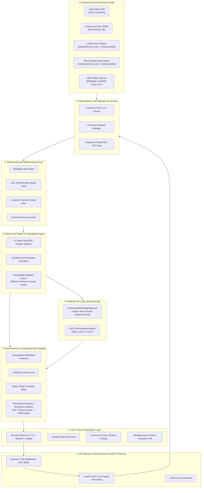

# HeatGuard AI — System Architecture

HeatGuard AI operates on an 8-tier, fault-tolerant, hybrid pipeline that decouples real-time deterministic bio-meteorology from asynchronous machine learning and simulated operational workflows.

---

## 🏛️ End-to-End Pipeline Diagram

---

## 🔬 Core Architectural Principles

1. **Separation of Determinism and Heuristics:**
   - Life-critical operational heat tiers (Green, Yellow, Orange, Red) are computed deterministically using standard bio-meteorological equations (ISO 7243, Steadman).
   - Machine Learning models (ML V2) are reserved exclusively for forward environmental outlook (predicting continuous apparent temperature 24 hours ahead) and are clearly demarcated as `EXPERIMENTAL`.

2. **Graceful Degradation:**
   - When external feeds (such as CPCB or IMD) are unauthenticated or offline, the system never halts. It tags data with explicit truth states (`CREDENTIALS_NOT_CONFIGURED` or `STATIC REFERENCE`) and continues calculating deterministic risk using verified fallback observations.

3. **Strict Spatial Normalization:**
   - All 67 wards of Bhubaneswar are individually mapped to high-resolution polygon geometries (`wards_bhubaneswar.geojson`), pairing microclimate metrics with census-derived demographic vulnerability.
