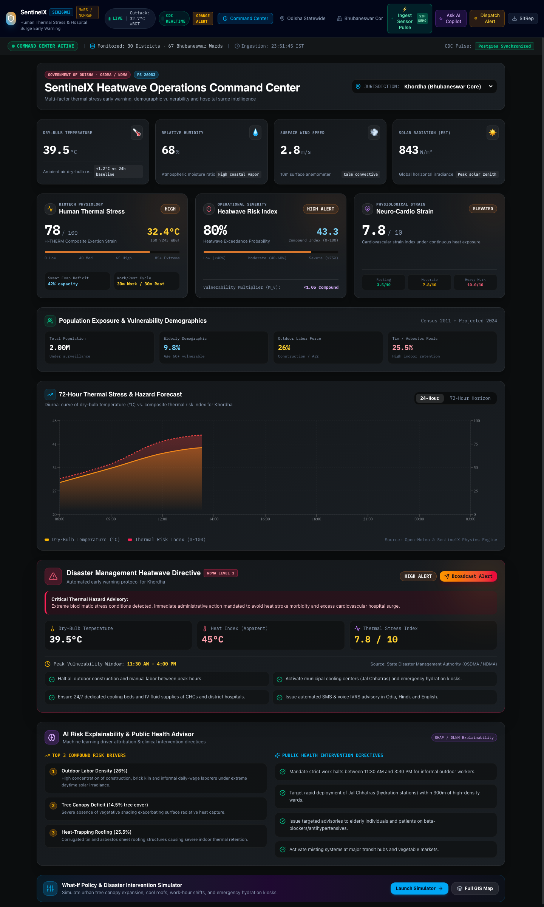
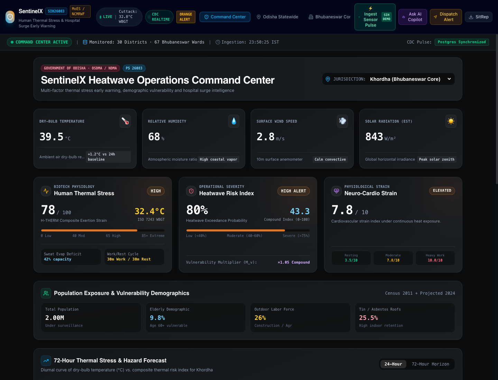
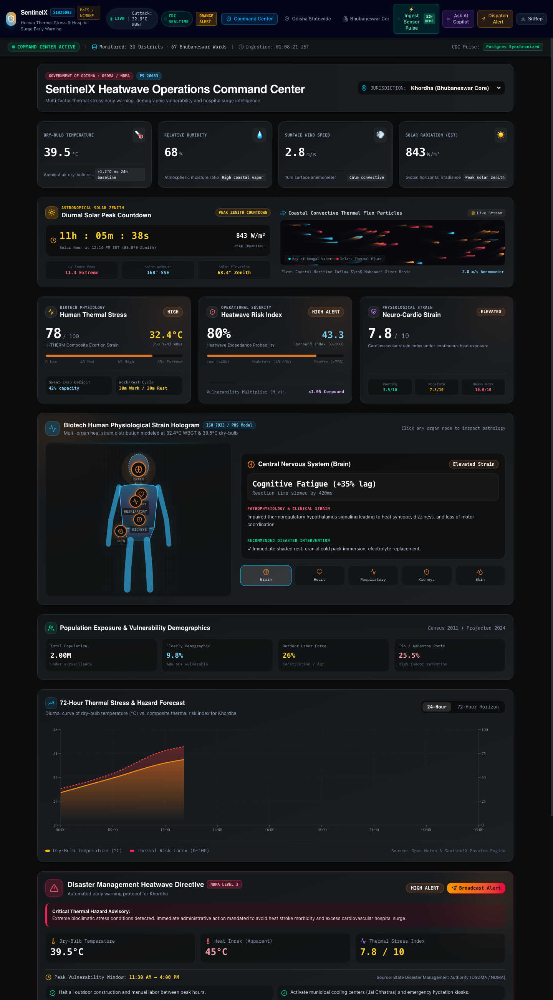

# HeatGuard AI — Interface & Operational Screenshots

This directory catalogs visual captures of the **HeatGuard AI** (SentinelX) production platform for evaluation during Smart India Hackathon 2026 judging.

All screenshots represent actual running platform views rendered from live and deterministic computational outputs.

---

## 1. Tactical Command Center Overview

*Figure 1: Full-screen view of the tactical command interface showing statewide Odisha thermal overview, telemetry ingestion metrics, active heat alerts, and system health status.*

---

## 2. Situation Room & Risk Index

*Figure 2: Primary operational cockpit showing district-level risk rankings, live heat index and wet bulb globe temperature (WBGT) exposure matrices, and automated action triggers.*

---

## 3. System Innovations & Architecture

*Figure 3: Overview of proprietary architectural innovations including localized 67-ward vulnerability scoring, H-THERM physiological models, and verifiable data provenance labeling.*

---

## 4. Key Operational Views for Judge Evaluation

When exploring the live platform at **[https://sentinelx-thermal-api-production-aa42.up.railway.app](https://sentinelx-thermal-api-production-aa42.up.railway.app)** or on local deployment (`http://localhost:3000`), judges can interactively inspect the following dedicated views via the collapsible sidebar:

| View | Navigation Path | Key Functional Elements |
| :--- | :--- | :--- |
| **Command Center** | `COMMAND` &rarr; `Command Center` | Realtime state-level heatmap, live telemetry feeds, trigger state |
| **67-Ward GIS** | `COMMAND` &rarr; `Bhubaneswar Core` | Interactive BMC 67-ward Leaflet GIS, polygon selection, ward metrics |
| **Odisha Statewide** | `COMMAND` &rarr; `Odisha Statewide` | 30-district risk ranking, hazard vs vulnerability scatter, regional breakdown |
| **Worker Safety** | `SAFETY & ACTION` &rarr; `Worker Safety` | ISO 7243 work/rest cycles, hydration intervals, occupational heat tiers |
| **School Safety** | `SAFETY & ACTION` &rarr; `School Safety` | Outdoor activity restrictions, morning shift recommendations, pediatric risk |
| **Resource Allocation** | `SAFETY & ACTION` &rarr; `Resource Allocation` | Water tanker dispatch, cooling shelter siting, ORS distribution mapping |
| **What-If Simulator** | `SAFETY & ACTION` &rarr; `What-If Simulator` | Dynamic temperature/humidity sliders, simulated ward surge response |
| **ML V2 Predictor** | `ANALYTICS` &rarr; `Hospital Surge ML` | Unseen holdout validation (MAE 1.08°C, R² 0.91), 36 engineered features |
| **H-THERM Engine** | `ANALYTICS` &rarr; `H-THERM Calculator` | Interactive bio-meteorological calculator (WBGT, UTCI, Steadman HI) |
| **NDMA Validation** | `ANALYTICS` &rarr; `NDMA Validation` | Ground-truth historical comparison against NDMA action plan benchmarks |
| **AI Copilot** | `ASSISTANCE` &rarr; `AI Copilot` | Grounded situational Q&A with strict safety and provenance guardrails |
| **Citizen Advisory** | `CITIZEN` &rarr; `Citizen Advisory` | Multi-language public advisories, preventive guidelines, emergency hotline (1078) |
| **Alert Audit Log** | Modal &rarr; `Emergency Broadcast` | Audit-trailed dry-run broadcast simulation with DPDP-compliant contact masking |

---

*Note: For complete architectural documentation and algorithmic derivations, refer to [`docs/README.md`](../docs/README.md) and the comprehensive [HeatGuard AI Project Report](../docs/HEATGUARD_AI_END_TO_END_PROJECT_REPORT.md).*
